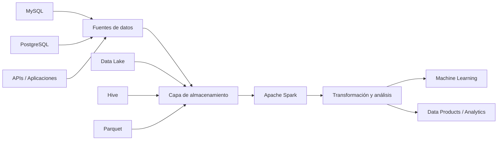
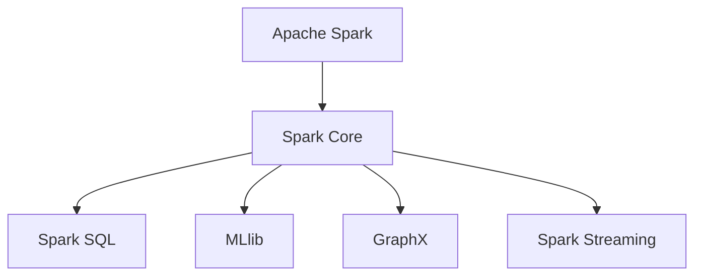
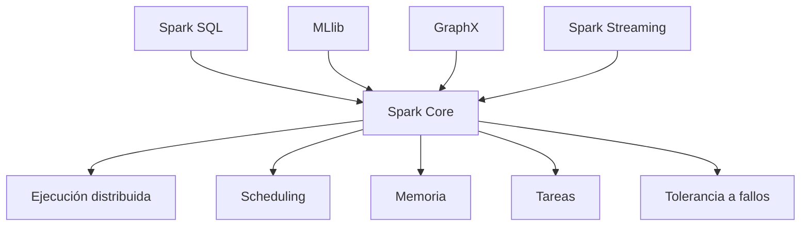
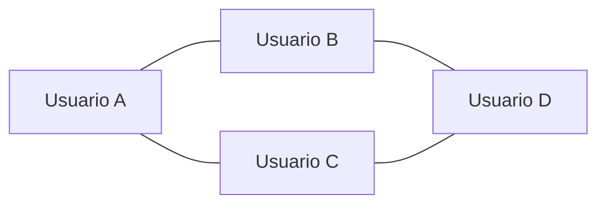
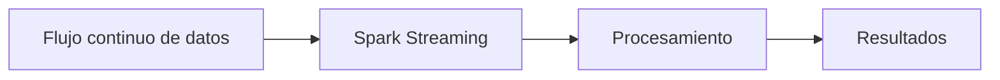
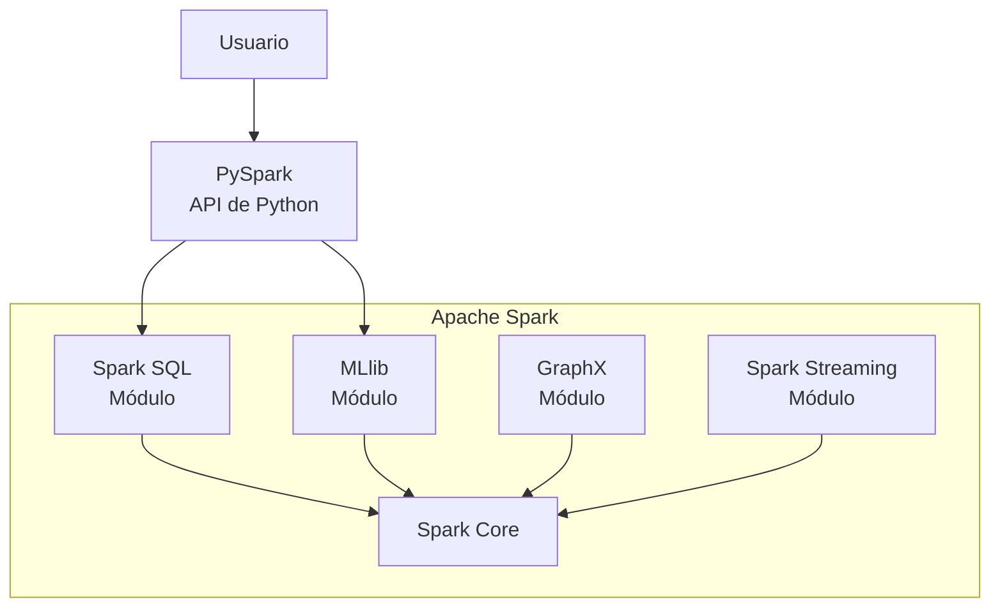
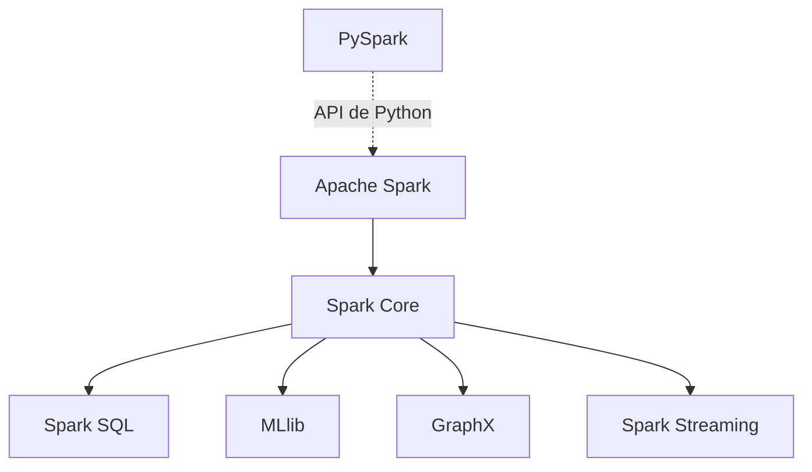
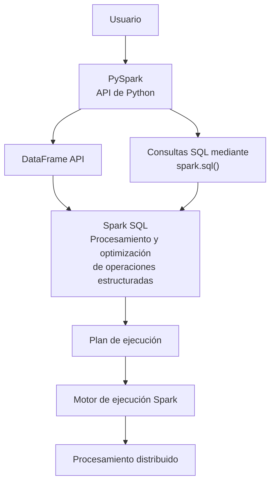
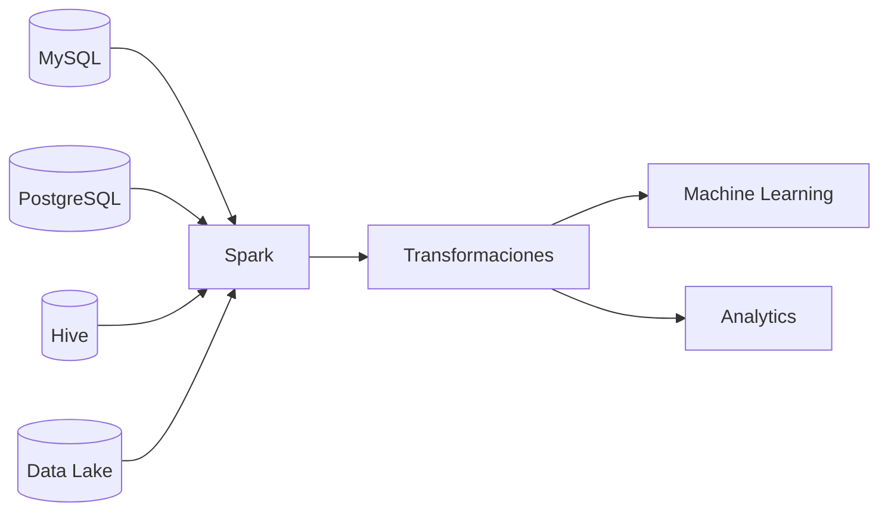
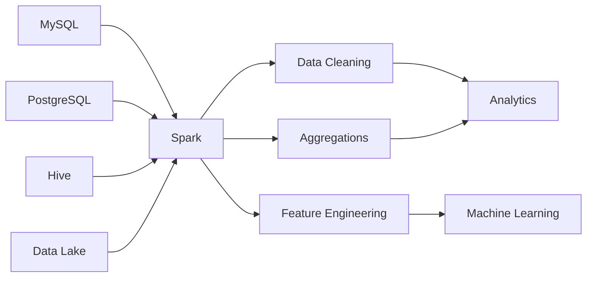

# 01 - Ecosistema Spark

## 1.1. ¿Qué es Apache Spark?

Apache Spark es un **framework de procesamiento distribuido** diseñado para procesar grandes volúmenes de datos de manera paralela sobre un conjunto de máquinas.

Spark permite construir aplicaciones para:

* procesamiento de datos;
* transformación y preparación de datos;
* consultas SQL;
* análisis exploratorio;
* ingeniería de características;
* machine learning;
* procesamiento batch;
* procesamiento de datos en streaming.

> Spark no es una base de datos ni un lenguaje de programación. Es un **motor de procesamiento** que puede trabajar con datos almacenados en diferentes sistemas.

---

## 1.2. Spark dentro del ecosistema de datos

Spark se encuentra principalmente en la capa de **procesamiento**.

Representación de una arquitectura simplificada:



> Spark no necesariamente almacena los datos. Su función principal es **procesarlos**.

---

## 1.3. Componentes principales del ecosistema Spark

El ecosistema de **Apache Spark** está formado por un núcleo común y diferentes módulos especializados que permiten utilizar Spark para distintos tipos de procesamiento de datos.

Conceptualmente, podemos representarlo de la siguiente manera:



El núcleo común es **Spark Core**, mientras que los demás módulos extienden las capacidades de Spark hacia diferentes necesidades de procesamiento.

> Un módulo es una parte de un sistema de software que agrupa funcionalidades relacionadas y permite resolver un tipo de problema específico.

Podemos imaginar que Apache Spark es una caja de herramientas para trabajar con datos. Dentro tiene diferentes herramientas especializadas: **cada módulo tiene una responsabilidad diferente, pero todos forman parte del ecosistema Spark.**

---

### Spark Core

**Spark Core** es el núcleo del framework de Apache Spark y proporciona la infraestructura fundamental sobre la cual funcionan los demás componentes.

Entre sus responsabilidades se encuentran:

* ejecución de procesamiento distribuido;
* scheduling de tareas;
* administración de memoria;
* comunicación entre componentes;
* tolerancia a fallos;
* manejo de datos distribuidos.

Los demás módulos del ecosistema utilizan esta infraestructura para ejecutar sus operaciones de manera distribuida.



---

### Spark SQL

**Spark SQL** es el módulo de Spark destinado al procesamiento de **datos estructurados y semiestructurados**.

Permite trabajar con datos mediante:

* SQL;
* DataFrames;
* operaciones estructuradas sobre datos.

Por ejemplo:

```sql
SELECT
    customer_id,
    AVG(revenue) AS avg_revenue
FROM customers
GROUP BY customer_id;
```

Aunque la consulta utiliza SQL, su ejecución se realiza utilizando la infraestructura distribuida de Spark.

Spark SQL permite, por lo tanto, combinar la expresividad de SQL con las capacidades de procesamiento distribuido de Spark.

---

### MLlib

**MLlib** es la librería de **Machine Learning de Spark**.

Proporciona algoritmos y herramientas para desarrollar modelos de aprendizaje automático utilizando datos que pueden ser procesados dentro del ecosistema Spark.

Entre sus capacidades se encuentran, entre otras:

* clasificación;
* regresión;
* clustering;
* reducción de dimensionalidad;
* selección y transformación de variables;
* pipelines de Machine Learning.

Ejemplo de flujo conceptual:


Esto permite integrar el procesamiento distribuido de datos y el desarrollo de modelos dentro de un mismo ecosistema.

---

### GraphX

**GraphX** es el componente de Spark orientado al **procesamiento de grafos**.

Un grafo representa entidades y las relaciones entre ellas mediante:

* **vértices (vertices)** → representan entidades;
* **aristas (edges)** → representan relaciones entre entidades.

Por ejemplo, una red social podría representarse como:



GraphX permite realizar operaciones y algoritmos sobre este tipo de estructuras utilizando las capacidades distribuidas de Spark.

Algunos casos de uso pueden involucrar:

* redes sociales;
* relaciones entre clientes;
* sistemas de recomendación;
* análisis de redes;
* detección de comunidades.

> GraphX forma parte del ecosistema clásico de Spark. Su importancia práctica puede variar dependiendo del entorno y de las tecnologías utilizadas en una organización.

---

### Spark Streaming

**Spark Streaming** permite procesar datos que llegan continuamente, en lugar de trabajar únicamente con conjuntos de datos estáticos.

Algunos ejemplos de datos que pueden procesarse de esta manera son:

* eventos;
* logs;
* transacciones;
* mensajes;
* métricas;
* eventos generados por aplicaciones.

Conceptualmente:



Esto permite construir aplicaciones capaces de reaccionar ante datos que llegan continuamente.

> En las arquitecturas modernas de Spark, el procesamiento de streams se realiza principalmente mediante **Structured Streaming**, que proporciona una API estructurada para este tipo de procesamiento.

---

### Spark y sus APIs

Es importante distinguir entre los **módulos del ecosistema** y las **APIs mediante las cuales interactuamos con Spark**.

Por ejemplo, **PySpark** no es un motor diferente de Spark ni un módulo independiente al mismo nivel que Spark SQL o MLlib.

**PySpark es la API de Python que permite utilizar Spark desde Python.**

De manera simplificada:



* **PySpark:** permite interactuar con Spark mediante código Python.
* **Spark SQL:** permite procesar datos estructurados utilizando SQL y la API de DataFrames.
* **MLlib:** proporciona algoritmos y herramientas de Machine Learning.
* **GraphX:** ofrece funcionalidades para el procesamiento de grafos.
* **Spark Streaming:** permite procesar flujos de datos. En las aplicaciones modernas, se utiliza principalmente Structured Streaming.
* **Spark Core:** proporciona la infraestructura fundamental para la ejecución distribuida.

Se puede utilizar PySpark para realizar diferentes tareas:

```python
# Data processing with DataFrames
df.filter(df.revenue > 1000)

# Machine Learning
from pyspark.ml.classification import LogisticRegression

model = LogisticRegression()
```

En el primer ejemplo, PySpark permite trabajar con DataFrames, utilizando las capacidades de Spark SQL. En el segundo, permite acceder a las funcionalidades de Machine Learning disponibles en PySpark.

Por tanto, utilizar PySpark no significa utilizar un motor diferente de Spark. Significa interactuar con el ecosistema Spark mediante Python.

Conviene recordar tres conceptos:

> * Apache Spark es el framework de procesamiento distribuido.
> * Los módulos proporcionan funcionalidades especializadas dentro del ecosistema.
> * Las APIs permiten interactuar con esas funcionalidades desde un lenguaje de programación.

---

### Resumen del ecosistema

Una forma sencilla de recordar la estructura es:

| Componente          | Propósito principal                                      |
| ------------------- | -------------------------------------------------------- |
| **Spark Core**      | Núcleo de ejecución distribuida                          |
| **Spark SQL**       | Procesamiento de datos estructurados y semiestructurados |
| **MLlib**           | Machine Learning distribuido                             |
| **GraphX**          | Procesamiento de grafos                                  |
| **Spark Streaming** | Procesamiento de datos en flujo                          |
| **PySpark**         | API de Python para utilizar Spark                        |

La relación conceptual puede resumirse así:



Por lo tanto, **Spark puede entenderse como un ecosistema de procesamiento distribuido cuyo núcleo es Spark Core y que incorpora diferentes módulos especializados para trabajar con datos estructurados, Machine Learning, grafos y procesamiento de streams.**

---

## 1.4. PySpark y Spark SQL

**PySpark y Spark SQL son conceptos diferentes, pero están estrechamente relacionados.** Para comprender cómo interactuamos con Spark desde Python, es importante distinguir el módulo que procesa los datos de la API que utilizamos para escribir nuestro código.

### ¿Qué es Spark SQL?

**Spark SQL es el módulo de Apache Spark especializado en el procesamiento de datos estructurados y semiestructurados.**

No se limita a ejecutar consultas escritas en SQL. También permite trabajar con datos mediante APIs de programación y proporciona mecanismos para analizar, optimizar y ejecutar operaciones estructuradas.

Spark SQL ofrece distintas formas de expresar estas operaciones:

* **SQL API:** permite escribir consultas utilizando el lenguaje SQL.
* **DataFrame API:** permite consultar y transformar datos mediante operaciones programáticas sobre DataFrames.
* **Dataset API:** proporciona una interfaz tipada, disponible principalmente en Scala y Java.

Estas interfaces permiten expresar operaciones de procesamiento de datos de diferentes maneras, aprovechando las capacidades de Spark SQL.

> **Nota:** en Scala, un DataFrame es esencialmente un `Dataset[Row]`. En PySpark se utiliza la API de DataFrames, pero no se dispone de la misma API tipada de `Dataset[T]` que existe en Scala y Java.

### ¿Qué es PySpark?

**PySpark es la API de Python que permite interactuar con Apache Spark desde el lenguaje Python.**

Mediante PySpark podemos acceder a diferentes funcionalidades del ecosistema Spark, entre ellas:

* procesamiento de datos mediante la API de DataFrames;
* ejecución de consultas SQL mediante Spark SQL;
* desarrollo de pipelines de Machine Learning mediante `pyspark.ml`;
* procesamiento de flujos de datos mediante Structured Streaming.

Por lo tanto, PySpark no es un motor de procesamiento independiente ni un módulo equivalente a Spark SQL o MLlib. Es una de las interfaces mediante las cuales podemos utilizar las funcionalidades de Spark desde Python.

### ¿Cómo se relacionan PySpark y Spark SQL?

Cuando utilizamos PySpark para transformar un DataFrame, expresamos las operaciones mediante código Python. Spark SQL puede analizar y optimizar esas operaciones antes de que se ejecuten de forma distribuida.



Este diagrama representa dos formas habituales de utilizar Spark SQL desde PySpark: mediante la API de DataFrames y mediante consultas SQL. Es una representación conceptual, no una descripción exhaustiva de todas las rutas internas de ejecución.

### Ejemplo 1. Utilizar la API de DataFrames

Supongamos que tenemos un DataFrame llamado `df` con información de clientes y una columna denominada `segment`.

Podemos agrupar los registros y contar cuántos hay en cada segmento:

```python
result = df.groupBy("segment").count()
```

Aquí utilizamos la API de DataFrames de PySpark. La operación se incorpora al plan de procesamiento estructurado de Spark y puede optimizarse antes de su ejecución.

### Ejemplo 2. Utilizar SQL mediante PySpark

Podemos expresar una operación equivalente utilizando SQL:

```python
result = spark.sql("""
    SELECT
        segment,
        COUNT(*) AS total
    FROM customers
    GROUP BY segment
""")
```

En este caso:

* `spark` es una instancia de `SparkSession`.
* `spark.sql()` permite enviar una consulta SQL a Spark.
* `customers` debe ser una tabla o vista accesible para la sesión.
* `result` es un DataFrame de Spark que contiene el resultado.

**La diferencia está en cómo expresamos la operación:** en el primer ejemplo utilizamos los métodos de la API de DataFrames; en el segundo escribimos una consulta SQL.

Ambas formas pueden generar planes de ejecución equivalentes cuando representan la misma operación sobre los mismos datos.

### Idea clave

> **PySpark** es la API de Python para interactuar con Spark. **Spark SQL** es el módulo que proporciona las capacidades de procesamiento estructurado, incluidas las consultas SQL y las operaciones sobre DataFrames.

Cuando utilizamos PySpark para manipular DataFrames, Spark puede analizar y optimizar las operaciones mediante Spark SQL y ejecutarlas de forma distribuida utilizando la infraestructura de Spark.

Así podemos escribir código Python para procesar grandes volúmenes de datos sin tener que implementar manualmente la distribución de las operaciones.


---

## 1.5. Spark y los sistemas de almacenamiento

Spark puede interactuar con diferentes fuentes y sistemas de almacenamiento.

Entre ellos:

* archivos CSV;
* Parquet;
* JSON;
* bases de datos relacionales;
* Hive;
* Data Lakes;
* sistemas distribuidos;
* otros sistemas accesibles mediante conectores.

Una arquitectura típica podría verse así:



Esto explica por qué Spark puede convertirse en una pieza central de una plataforma de datos empresarial.

---

## 1.6. Spark no es una base de datos

Una distinción fundamental:

| Tecnología | Función principal                                                    |
| ---------- | -------------------------------------------------------------------- |
| MySQL      | Base de datos relacional                                             |
| PostgreSQL | Base de datos relacional                                             |
| Hive       | Data warehouse / capa de tablas y metadatos sobre datos distribuidos |
| Spark      | Motor de procesamiento distribuido                                   |
| PySpark    | API de Python para Spark                                             |


Por ejemplo:

```text
PostgreSQL
    │
    │ datos
    ▼
  Spark
    │
    │ procesamiento
    ▼
Dataset preparado
    │
    ▼
  H2O
    │
    │ entrenamiento
    ▼
Modelo ML
```

Cada componente tiene una responsabilidad diferente.

---

## 1.7. Spark como punto de integración

Una de las razones por las que Spark es tan importante en plataformas de datos es que puede actuar como una capa de procesamiento entre diferentes sistemas.



Spark permite centralizar gran parte de las transformaciones sin exigir que todos los datos estén almacenados originalmente en el mismo sistema.

---

## 1.8. Modelo mental


> **Spark es un motor distribuido que recibe datos desde diferentes fuentes, ejecuta transformaciones y produce resultados de manera paralela.**

El siguiente paso es entender **por qué necesitamos procesamiento distribuido en primer lugar**.