# 02 - Procesamiento distribuido

## 2.1. ¿Qué es el procesamiento distribuido?

El **procesamiento distribuido** consiste en dividir una tarea computacional entre múltiples recursos de cómputo que trabajan de manera coordinada.

En lugar de procesar todo el dataset utilizando una sola máquina:

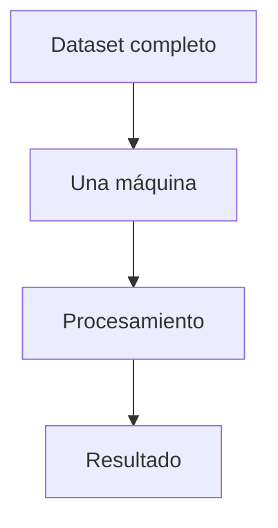

El dataset y el trabajo pueden distribuirse entre varias máquinas:

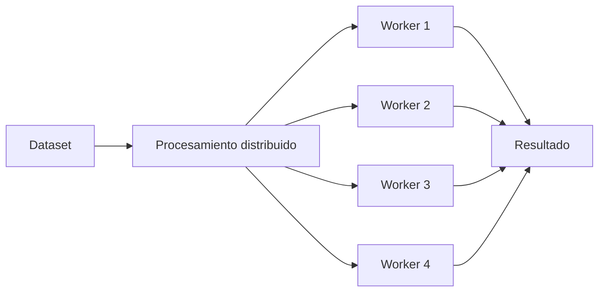

Cada worker procesa una parte del trabajo y los resultados se coordinan para producir el resultado final.

---

## 2.2. Procesamiento local vs distribuido

### Procesamiento local

En un escenario local, una sola máquina es responsable de:

* almacenar o acceder a los datos;
* ejecutar las operaciones;
* utilizar CPU;
* utilizar memoria;
* producir el resultado.

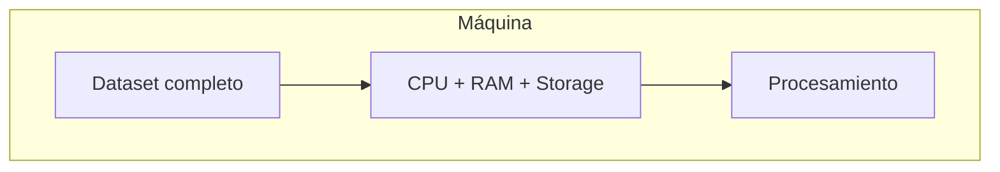

Esto funciona perfectamente para datasets que caben razonablemente en los recursos disponibles.

---

### Procesamiento distribuido

En procesamiento distribuido, el trabajo se reparte entre diferentes recursos.

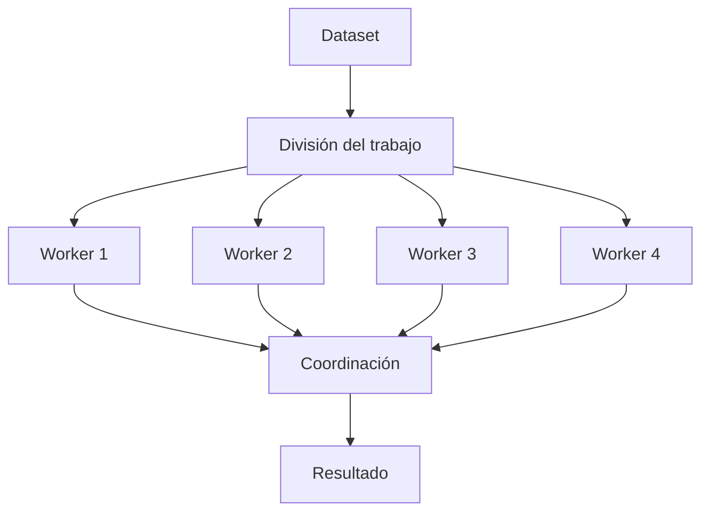

El objetivo es aprovechar múltiples recursos de cómputo de forma coordinada.

---

## 2.3. ¿Por qué distribuir el procesamiento?

El procesamiento distribuido puede ofrecer varias ventajas.

### Escalabilidad

Permite aumentar la capacidad de procesamiento agregando recursos.

```text
Más datos
   │
   ▼
Más trabajo
   │
   ▼
Más recursos de cómputo
```

En lugar de depender exclusivamente de hacer una máquina cada vez más potente, podemos aumentar el número de máquinas disponibles.

---

### Paralelismo

La distribución permite ejecutar diferentes partes de una tarea simultáneamente.

Supongamos un dataset dividido en cuatro partes:

```text
Dataset
│
├── Partición 1
├── Partición 2
├── Partición 3
└── Partición 4
```

En un escenario paralelo:

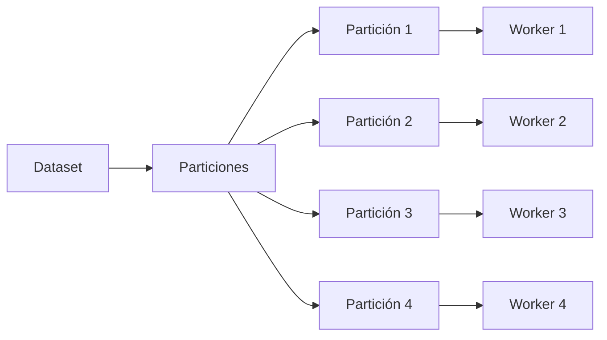

Las cuatro partes pueden procesarse simultáneamente.

Esto es diferente de procesarlas secuencialmente:

```text
Partición 1 → Partición 2 → Partición 3 → Partición 4
```

---

## 2.4. Paralelismo ≠ distribución

Estos conceptos están relacionados, pero no son exactamente lo mismo.

### Paralelismo

Significa ejecutar múltiples tareas al mismo tiempo.

### Distribución

Significa repartir datos o trabajo entre diferentes recursos de cómputo.

Podemos tener paralelismo dentro de una misma máquina:

```text
              Una máquina
        ┌────────────────────┐
        │                    │
        │ CPU Core 1 ──────► │
        │ CPU Core 2 ──────► │
        │ CPU Core 3 ──────► │
        │ CPU Core 4 ──────► │
        │                    │
        └────────────────────┘
```

Y podemos tener paralelismo distribuido:

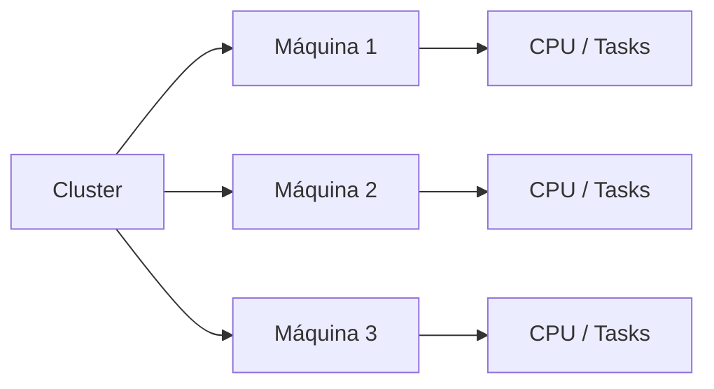

Spark aprovecha ambos niveles.

---

## 2.5. Dataset dividido en partes

Una de las ideas fundamentales para comprender Spark es que un dataset puede dividirse en **particiones**.

Supongamos:

```text
Dataset = 1,000,000 registros
```

Podríamos representarlo conceptualmente como:

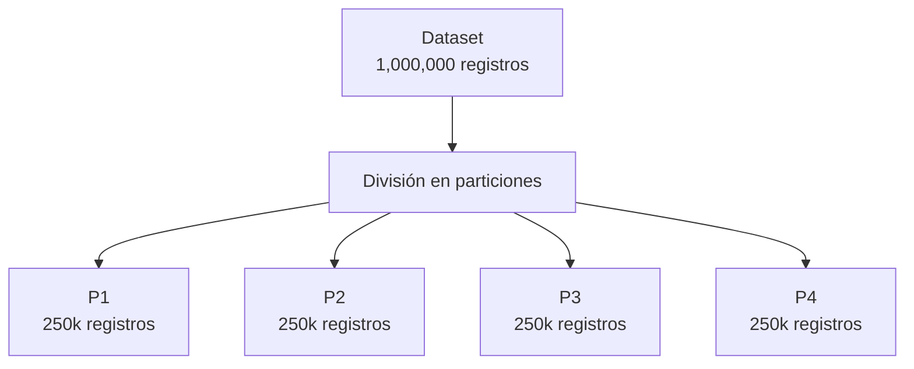

Cada partición representa una porción del dataset que puede ser procesada independientemente cuando la operación lo permite.

---

## 2.6. Worker nodes

En un cluster distribuido existen diferentes máquinas o recursos de cómputo que participan en la ejecución.

Podemos simplificarlo como:

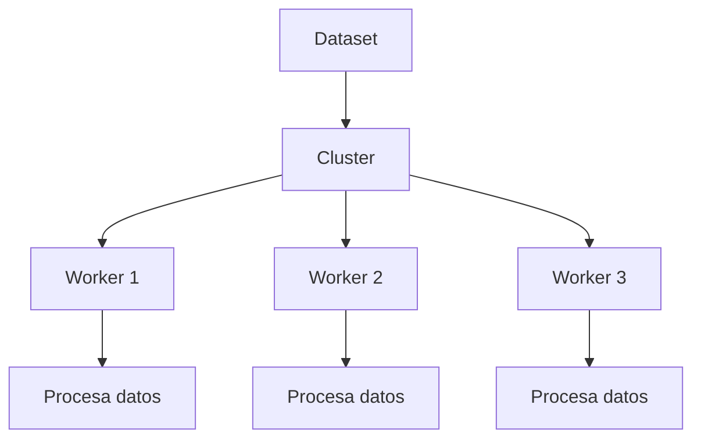

Cada worker puede ejecutar tareas sobre diferentes partes del dataset.

---

## 2.7. El concepto de cluster

Un **cluster** es un conjunto de recursos de cómputo que trabajan conjuntamente.

Conceptualmente:

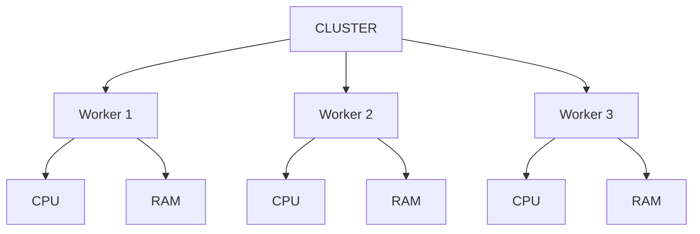

Desde la perspectiva de una aplicación Spark, el cluster proporciona los recursos necesarios para ejecutar las tareas.

> Un **cluster** no significa necesariamente que existan físicamente varias computadoras independientes. Dependiendo del entorno, Spark también puede ejecutarse localmente utilizando múltiples cores.

---

## 2.8. Escalabilidad vertical y horizontal

El procesamiento distribuido está relacionado con dos estrategias para aumentar la capacidad de cómputo.

### Escalabilidad vertical

Consiste en aumentar los recursos de una sola máquina.

```text
Máquina
│
├── 8 CPU
├── 32 GB RAM
│
▼
64 CPU
256 GB RAM
```

También se conoce como **scale up**.

---

### Escalabilidad horizontal

Consiste en agregar más máquinas o nodos.

```text
Antes:

┌───────────┐
│ Worker 1  │
└───────────┘


Después:

┌───────────┐
│ Worker 1  │
└───────────┘
┌───────────┐
│ Worker 2  │
└───────────┘
┌───────────┐
│ Worker 3  │
└───────────┘
```

También se conoce como **scale out**.

Los sistemas distribuidos, incluido Spark, están diseñados para aprovechar principalmente esta estrategia.

---

## 2.9. ¿Qué ocurre cuando una tarea se distribuye?

Supongamos una operación de agregación:

```text
Calcular ventas totales
```

Tenemos:

```text
Dataset
│
├── Partición 1
├── Partición 2
├── Partición 3
└── Partición 4
```

Spark puede ejecutar cálculos parciales:

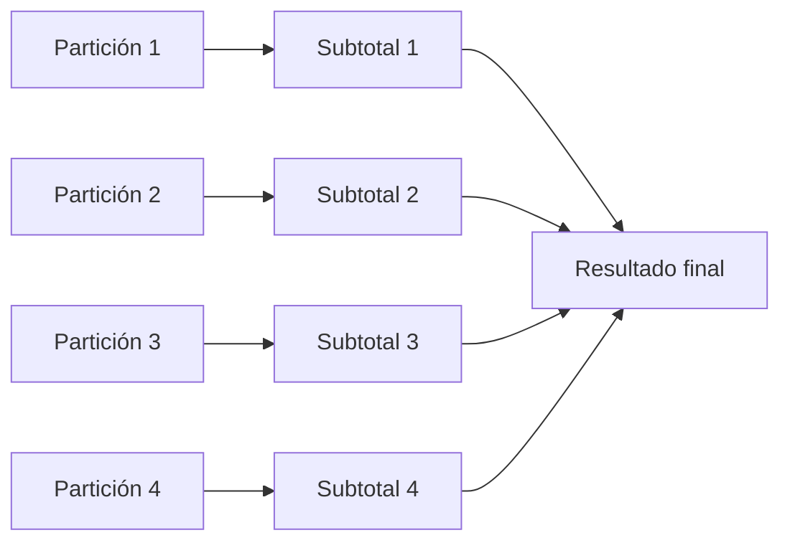

Finalmente, los resultados parciales se combinan para obtener el resultado global.

```text
Subtotal 1
    +
Subtotal 2
    +
Subtotal 3
    +
Subtotal 4
    =
Total
```

Este patrón de **cálculo parcial + combinación** es fundamental para entender cómo Spark puede procesar grandes datasets de forma paralela.

---

## 2.10. ¿Todo puede procesarse en paralelo?

No todo puede procesarse en paralelo. Esta es una de las ideas más importantes del procesamiento distribuido.

Algunas operaciones pueden realizarse independientemente sobre cada partición.

Por ejemplo:

```text
filter
select
withColumn
```

Conceptualmente:

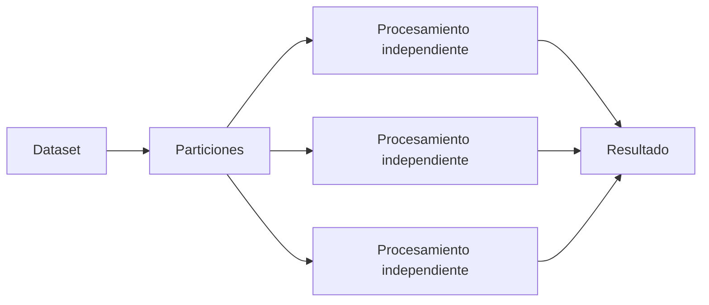

Pero otras operaciones requieren **intercambiar datos entre particiones**. Esto puede producir un **shuffle**.

### ¿Qué es un Shuffle?

Un **shuffle** es el proceso mediante el cual Spark debe **mover y redistribuir datos entre nodos o particiones** para poder realizar ciertas operaciones.

Normalmente Spark intenta procesar los datos localmente dentro de cada partición. Sin embargo, algunas transformaciones requieren reorganizar los registros según una clave determinada, lo que obliga a transferir información a través de la red.

### Ejemplo conceptual

Antes del shuffle:

```text
Nodo 1            Nodo 2            Nodo 3
MX                MX                US
US                ES                MX
MX                ES                US
```

Operación:

```python
df.groupBy("pais").count()
```

Después del shuffle:

```text
Nodo 1            Nodo 2            Nodo 3
MX                US                ES
MX                US                ES
MX                US
MX
```

Ahora Spark puede contar correctamente los registros de cada país.

---

### ¿Por qué es costoso?

Durante un shuffle se generan operaciones adicionales:

- Movimiento de datos por la red.
- Uso adicional de memoria.
- Escritura temporal en disco.
- Mayor tiempo de ejecución.

Durante operaciones normales:

```text
Executor
   │
   └── Procesa datos locales
```

Durante un shuffle:

```text
Executor 1 ──►
Executor 2 ──►  Red
Executor 3 ──►
Executor 4 ──►
```

Los datos deben viajar entre máquinas.

---

### Operaciones que suelen generar Shuffle

#### groupBy

```python
df.groupBy("pais").count()
```

#### join

```python
clientes.join(ventas, "id_cliente")
```

#### distinct

```python
df.distinct()
```

#### repartition

```python
df.repartition(20)
```

#### orderBy

```python
df.orderBy("fecha")
```

#### dropDuplicates

```python
df.dropDuplicates()
```

---

### Operaciones que normalmente NO generan Shuffle

#### select

```python
df.select("nombre")
```

#### filter

```python
df.filter(df.edad > 18)
```

#### withColumn

```python
df.withColumn("monto_doble", df.monto * 2)
```

#### cast

```python
df.withColumn("edad", df.edad.cast("int"))
```

#### renombrar columnas

```python
df.withColumnRenamed("nom", "nombre")
```

Estas transformaciones trabajan sobre cada partición de forma independiente, sin necesidad de mover datos.

---

### ¿Cómo identificar un Shuffle?

Se puede inspeccionar el plan de ejecución:

```python
df.explain(True)
```

Si se observan términos como:

```text
Exchange
```

o

```text
ShuffleExchange
```

Spark está realizando un shuffle.

Ejemplo:

```text
== Physical Plan ==
Exchange hashpartitioning(...)
```

---

### ¿El Shuffle es negativo?

No. El shuffle es un mecanismo normal y necesario para ciertas operaciones distribuidas.

* **Necesario:** El negocio requiere una agregación global y Spark necesita reorganizar los datos.


```python
ventas.groupBy("mes").sum()
```

* **Innecesario:** Para un dataset pequeño. En este caso se está moviendo una gran cantidad de datos sin obtener beneficios reales.

```python
df.repartition(500)
```

> El shuffle no es negativo. Lo que es negativo es hacer shuffle innecesario o excesivo.

---

### Regla de oro para ETLs en Spark

Cuando se analiza un ETL, podemos pensar en lo siguiente:

```text
filter()      → generalmente barato
select()      → generalmente barato

groupBy()     → sospecha shuffle
join()        → sospecha shuffle
distinct()    → sospecha shuffle
orderBy()     → sospecha shuffle
repartition() → sospecha shuffle
```

Si un proceso tarda demasiado:

1. Revisar primero los `join`.
2. Revisar después los `groupBy`.
3. Buscar operaciones `distinct`.
4. Analizar cuántos shuffles se están generando.

### Principio fundamental

> En Spark, normalmente el problema no es el cálculo; el problema suele ser el movimiento de datos.

Un ETL eficiente intenta minimizar la cantidad de datos que deben viajar entre nodos.
Por ello es común aplicar filtros tempranos (`filter`) y seleccionar únicamente las columnas necesarias (`select`) antes de realizar agregaciones o joins.


---

## 2.11. El costo de distribuir

El procesamiento distribuido no es gratis. Distribuir trabajo introduce costos asociados con:

* comunicación entre nodos;
* transferencia de datos;
* serialización;
* coordinación;
* almacenamiento temporal;
* recuperación ante fallos.

Por eso:

> **Más máquinas no significa automáticamente más velocidad.**

Si una operación requiere mover enormes cantidades de datos entre nodos, el costo de comunicación puede convertirse en el cuello de botella.

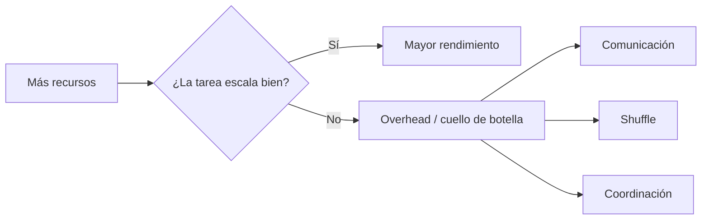

Esta idea es fundamental para entender la optimización de Spark.

---

## 2.12. Tolerancia a fallos

Otra ventaja importante de los sistemas distribuidos es la capacidad de recuperarse ante determinados fallos.

En un sistema distribuido:

```text
Worker 1 ──► OK
Worker 2 ──► FALLA
Worker 3 ──► OK
```

el framework puede identificar el fallo y volver a ejecutar determinadas tareas.

Spark utiliza información sobre el procesamiento para poder reconstruir resultados cuando determinados datos intermedios o tareas se pierden.

La idea fundamental es:

> **Un fallo en un worker no necesariamente implica que toda la aplicación deba comenzar desde cero.**

### ¿Por qué es importante?

En entornos Big Data es habitual trabajar con:

- Decenas o cientos de servidores.
- Miles de tareas ejecutándose en paralelo.
- Grandes volúmenes de información.
- Procesos que pueden durar minutos u horas.

A medida que aumenta el número de máquinas, también aumenta la probabilidad de que alguna falle durante la ejecución.

Por ello, Spark está diseñado bajo la premisa de que los fallos son normales y deben poder gestionarse automáticamente.

---

### Ejemplo conceptual

Supongamos un dataset dividido en cuatro particiones:

```text
Dataset
│
├─ Partición 1 → Worker 1
├─ Partición 2 → Worker 2
├─ Partición 3 → Worker 3
└─ Partición 4 → Worker 4
```

Durante la ejecución:

```text
Worker 1 ──► OK
Worker 2 ──► FALLA
Worker 3 ──► OK
Worker 4 ──► OK
```

Spark detecta que las tareas asignadas al Worker 2 se han perdido.

En lugar de reiniciar todo el proceso:

```text
❌ Reejecutar todo el Job
```

Spark puede hacer:

```text
✅ Reejecutar únicamente las tareas perdidas
```

Esto reduce considerablemente el impacto del fallo.

---

### El concepto de Lineage

La principal estrategia de recuperación de Spark se basa en el **Lineage**.

El Lineage es el historial lógico de transformaciones que han generado un conjunto de datos.

Por ejemplo:

```python
df = spark.read.parquet("clientes")
df2 = df.filter(df.edad > 18)
df3 = df2.groupBy("pais").count()
```

Spark registra algo conceptualmente similar a:

```text
clientes
   │
   ▼
filter()
   │
   ▼
groupBy()
   │
   ▼
resultado
```

Si alguna partición del resultado se pierde, Spark puede reconstruirla aplicando nuevamente las transformaciones necesarias sobre los datos originales.

---

### ¿Qué ocurre cuando falla un Worker?

De forma simplificada:

```text
Fallo del Worker
        │
        ▼
Spark detecta la pérdida
        │
        ▼
Identifica las particiones afectadas
        │
        ▼
Consulta el Lineage
        │
        ▼
Reejecuta únicamente las tareas necesarias
        │
        ▼
Continúa el Job
```

Gracias a este mecanismo, el sistema puede continuar trabajando incluso cuando parte de la infraestructura presenta problemas.

---

### Relación con las particiones

La tolerancia a fallos funciona especialmente bien porque Spark divide los datos en particiones independientes.

```text
Dataset
│
├─ Partición 1
├─ Partición 2
├─ Partición 3
└─ Partición 4
```

Si se pierde una partición:

```text
Partición 3 → Perdida
```

no es necesario recalcular todo el dataset.

Spark intenta reconstruir únicamente la partición afectada.

---

### Beneficios

- Mayor disponibilidad del sistema.
- Menor impacto ante fallos de hardware.
- Recuperación automática de tareas perdidas.
- Ejecución más confiable de ETLs y procesos analíticos.
- Posibilidad de operar clusters grandes sin depender de una única máquina.

---

### Relación con los ETLs

Durante un ETL distribuido pueden surgir problemas como:

- Caída de un servidor.
- Pérdida temporal de conectividad.
- Finalización inesperada de un executor.
- Errores de hardware.

Gracias a la tolerancia a fallos:

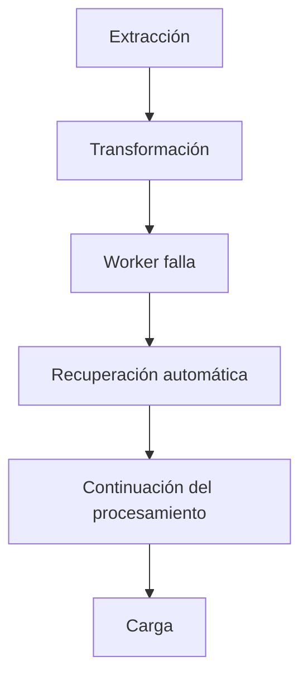

el proceso puede continuar sin necesidad de comenzar nuevamente desde el inicio.

---

### Diferencia con un sistema tradicional

En un sistema tradicional:

```text
Máquina única
      │
      ▼
Falla
      │
      ▼
Proceso detenido
```

En un sistema distribuido con Spark:

```text
Cluster
      │
      ▼
Falla un Worker
      │
      ▼
Reejecución de tareas
      │
      ▼
Proceso continúa
```

La aplicación completa no depende de una única máquina.

---

### Idea clave

> Spark asume que los fallos son inevitables. En lugar de intentar evitarlos por completo, diseña la ejecución de forma que pueda reconstruir únicamente el trabajo perdido y continuar procesando los datos.

---

## 2.13. Resumen procesamiento distribuido en Spark

Podemos resumir el modelo conceptual de Spark así:

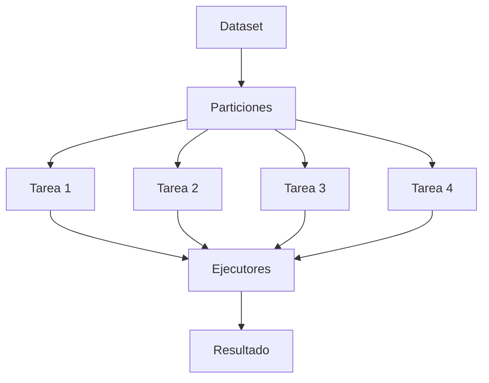

Esta representación es una simplificación. En Spark existen conceptos específicos que explican quién coordina la aplicación, dónde se ejecutan las tareas y cómo se distribuyen los recursos.

---

### Ideas clave

> 1. El procesamiento distribuido **divide datos o trabajo** entre múltiples recursos de cómputo.
> 2. El paralelismo permite **ejecutar múltiples tareas simultáneamente**.
> 3. Un **cluster** agrupa recursos de cómputo que trabajan conjuntamente.
> 4. Spark divide los datos en **particiones**, que constituyen una unidad fundamental de procesamiento.
> 5. **No todas las operaciones** pueden ejecutarse independientemente sobre cada partición.
> 6. Algunas operaciones requieren redistribuir datos entre nodos, generando **shuffle**.
> 7. La distribución permite escalar el procesamiento, pero introduce **costos de comunicación y coordinación**.
> 8. Más recursos **no garantizan** automáticamente mejor rendimiento.
> 9. Spark utiliza mecanismos de **tolerancia a fallos** para recuperar determinadas tareas cuando ocurren errores.
> 10. Comprender **procesamiento distribuido** es necesario antes de estudiar el funcionamiento interno de Spark.

