# 03 - Arquitectura de Spark

---

## 3.1. Visión general de la arquitectura

**Apache Spark es un motor de procesamiento distribuido que permite ejecutar operaciones sobre grandes volúmenes de datos utilizando los recursos de una o varias máquinas.**

Para comprender su arquitectura, conviene separar tres perspectivas complementarias:

1. **Arquitectura física:** dónde se ejecuta Spark y qué recursos computacionales utiliza.
2. **Arquitectura lógica de ejecución:** cómo Spark organiza, planifica y coordina el procesamiento.
3. **Integración con el ecosistema:** cómo Spark obtiene recursos y accede a datos almacenados en otros sistemas.

Estas perspectivas no representan tres arquitecturas independientes. Son distintas formas de analizar cómo funciona una aplicación Spark.

> Una **Aplicación Spark** es una instancia completa de ejecución de un programa desarrollado con Apache Spark. Cuando un usuario ejecuta un script, notebook o proceso mediante Spark, se crea una aplicación que agrupa todos los recursos y componentes necesarios para realizar el procesamiento distribuido.

---

### 3.1.1. Arquitectura física

La arquitectura física describe la infraestructura computacional donde se ejecuta Spark.

Sus principales componentes son:

* **Clúster:** conjunto de máquinas (nodos de trabajo) que colaboran para ejecutar los procesos de la aplicación Spark.
* **Nodos:** máquinas que forman parte del clúster.
* **CPU y cores:** recursos de procesamiento que permiten ejecutar tareas.
* **Memoria RAM:** recurso utilizado durante el procesamiento de datos y la ejecución de las operaciones.
* **Almacenamiento:** espacio donde pueden residir los datos de entrada, los resultados y los archivos intermedios.

En una ejecución distribuida, Spark puede aprovechar recursos de varios nodos para procesar diferentes partes de un conjunto de datos.

Es importante distinguir entre la infraestructura física y los componentes de software que se ejecutan sobre ella. Por ejemplo, un nodo es una máquina; un executor es un proceso de Spark que se ejecuta en la infraestructura y utiliza sus recursos.


---

### 3.1.2. Arquitectura lógica de ejecución

La arquitectura lógica describe cómo Spark transforma una aplicación en trabajo ejecutable y coordina su procesamiento.

Sus principales componentes y conceptos son:

* **SparkSession:** punto de entrada habitual para interactuar con Spark desde aplicaciones que utilizan Spark SQL y DataFrames.
* **Driver:** proceso que coordina la aplicación y organiza la ejecución de los trabajos.
* **Job:** unidad de trabajo que Spark ejecuta como consecuencia de determinadas operaciones, normalmente una acción.
* **Stage:** etapa en la que se divide un job según las dependencias entre las operaciones.
* **Task:** unidad de trabajo que procesa una partición dentro de un stage.
* **Lazy evaluation (evaluación perezosa):** estrategia por la que Spark puede aplazar la ejecución de las operaciones hasta que necesita producir un resultado.

Estos conceptos están relacionados, pero no son equivalentes.

Por ejemplo, el driver coordina la ejecución de los jobs; cada job puede dividirse en varios stages; y cada stage puede contener múltiples tasks. Las tasks procesan particiones de datos utilizando los recursos de los executors.

> El **Driver** es el primer proceso principal que se crea al iniciar una Spark Application. Dentro del Driver se ejecuta el código del usuario y normalmente se crea la SparkSession, que es la interfaz de acceso al ecosistema Spark.

La evaluación perezosa permite que Spark analice y optimice las operaciones antes de ejecutarlas cuando corresponde.

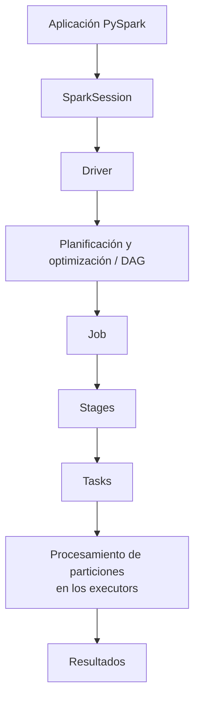

1. El Driver ejecuta el código de la aplicación Spark y construye un DAG (Directed Acyclic Graph) que representa las transformaciones solicitadas.
2. Cuando se encuentra una Action (por ejemplo, `show()`, `count()` o `write()`), Spark genera un Job.
3. Cada Job se divide en uno o varios Stages. Normalmente separados por operaciones que requieren Shuffle.
4. A su vez, cada Stage se divide en Tasks, generalmente una por cada partición de datos.

5. Finalmente, las Tasks son distribuidas a los Executors del cluster para su ejecución.

---

### 3.1.3. Integración con el ecosistema

Spark puede trabajar junto con otros sistemas que proporcionan datos, metadatos o administración de recursos.

Entre los componentes relevantes se encuentran:

* **YARN:** administrador de recursos que puede asignar recursos computacionales a aplicaciones Spark dentro de un clúster Hadoop.
* **Hive:** tecnología del ecosistema Hadoop que incluye capacidades de gestión de tablas y metadatos mediante Hive Metastore, además de componentes para consultar datos.
* **Fuentes de datos:** sistemas como PostgreSQL y MySQL, archivos en un Data Lake y otras fuentes compatibles.

La integración depende de la configuración y de los conectores disponibles. Por ejemplo, Spark puede consultar tablas registradas en un catálogo compatible con Hive y leer los datos subyacentes desde el almacenamiento correspondiente.

También es importante distinguir responsabilidades: YARN puede administrar la asignación de recursos, mientras que Spark coordina y ejecuta el procesamiento de la aplicación.

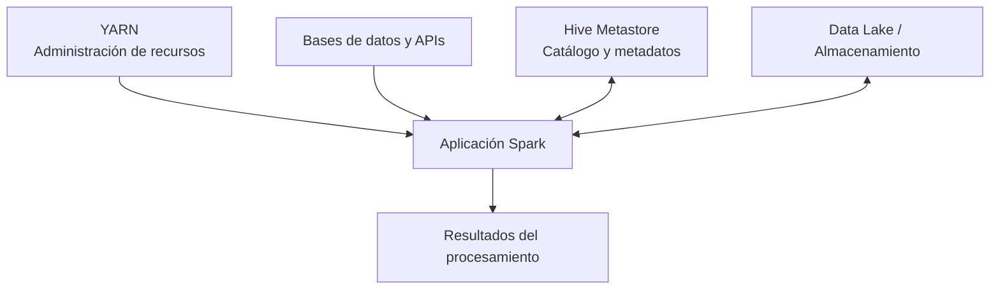

Este diagrama resume relaciones posibles, no una configuración obligatoria. Spark puede ejecutarse sin YARN y puede consultar datos sin utilizar Hive.

---

### 3.1.4. Cómo se complementan las tres perspectivas

| Perspectiva                   | Pregunta principal                           | Conceptos clave                                             |
| ----------------------------- | -------------------------------------------- | ----------------------------------------------------------- |
| Física                        | ¿Dónde y con qué recursos se procesa?        | Clúster, nodos, CPU, cores, RAM y almacenamiento            |
| Lógica de ejecución           | ¿Cómo se organiza y coordina el trabajo?     | SparkSession, driver, jobs, stages, tasks y lazy evaluation |
| Integración con el ecosistema | ¿Cómo obtiene recursos y accede a los datos? | YARN, Hive, catálogos, bases de datos y Data Lakes          |

Las tres perspectivas se complementan para explicar una ejecución distribuida:

1. La infraestructura proporciona los recursos computacionales.
2. Spark organiza el trabajo y coordina su ejecución.
3. Los sistemas integrados proporcionan datos, metadatos o recursos, según la configuración.

---

### 3.1.5. Modelo conceptual completo

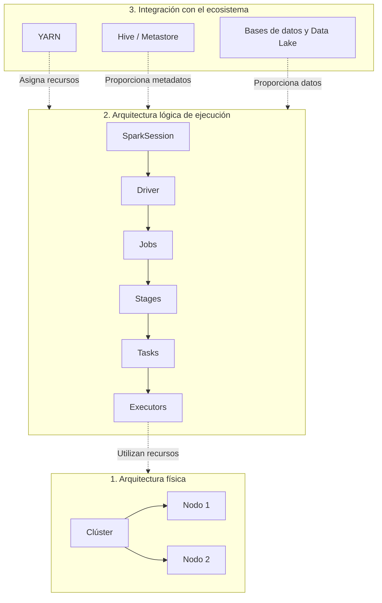

El modelo es conceptual: los executors se ejecutan en nodos, y el driver también necesita ejecutarse en un entorno computacional. Su ubicación depende del modo de despliegue. YARN es opcional y Hive no es un requisito para todas las aplicaciones Spark.

---

## 3.2. Clústeres y nodos

--- 

### 3.2.1. ¿Qué es un clúster?

Un **clúster** es un conjunto de máquinas (nodos) que trabajan de manera coordinada para ejecutar aplicaciones o procesar cargas de trabajo.

En Apache Spark, un clúster permite distribuir el procesamiento entre diferentes máquinas, aprovechando los recursos computacionales disponibles en cada una.

En lugar de depender exclusivamente de la capacidad de una sola máquina, una aplicación Spark puede utilizar recursos de múltiples nodos para procesar diferentes partes de un conjunto de datos.

Un clúster puede estar compuesto por máquinas físicas, máquinas virtuales o instancias en la nube.

> Un cluster es un **conjunto de nodos conectados** que trabajan juntos como si fueran un único sistema.

---

### Ejemplo conceptual

Supongamos que necesitamos procesar un conjunto de datos de 1 millón de registros.

En una configuración distribuida, Spark puede dividir el trabajo y procesar diferentes particiones utilizando recursos de varios nodos.

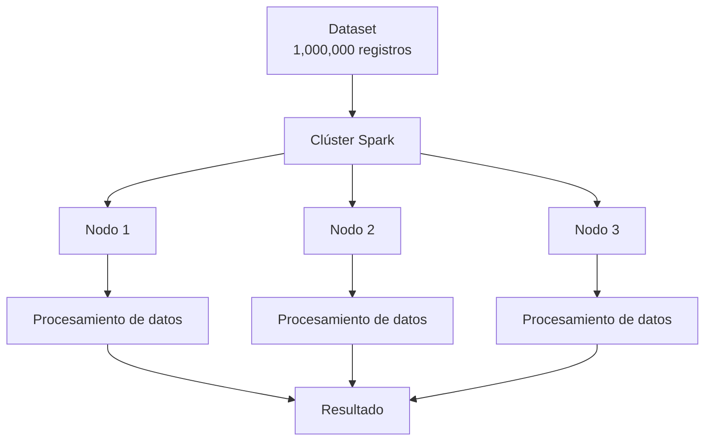

---

### 3.2.2. ¿Qué es un nodo?

Un **nodo** es una máquina que forma parte de un clúster.

Cada nodo dispone de recursos computacionales propios, que pueden utilizarse para ejecutar componentes de una aplicación distribuida.

Los principales recursos son:

* **CPU:** ejecuta las instrucciones de los programas.
* **Cores:** unidades de procesamiento que permiten ejecutar trabajo en paralelo.
* **Memoria RAM:** almacena temporalmente datos y estructuras utilizadas durante la ejecución.
* **Almacenamiento:** conserva archivos, datos y otros recursos necesarios para la aplicación.

En Spark, los nodos pueden desempeñar diferentes funciones según la configuración del clúster y el modo de despliegue.

Por ejemplo, un nodo puede alojar el proceso driver, procesos executor o ambos. En determinados despliegues, el driver se ejecuta fuera del clúster de workers.

---

### Estructura de un clúster

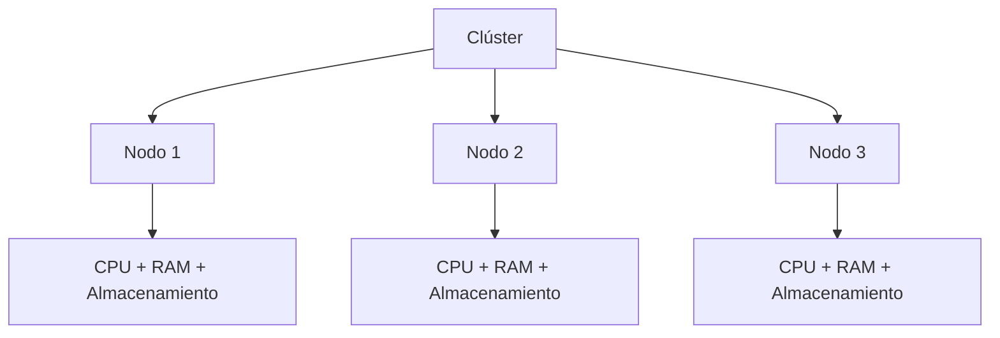

El clúster reúne las máquinas y sus recursos, pero no convierte automáticamente toda la memoria ni toda la capacidad de procesamiento en un único recurso físico. Spark coordina el trabajo entre máquinas que mantienen sus propios recursos.

> El cluster coordina múltiples memorias independientes para que trabajen juntas sobre un mismo problema.

---

### 3.2.3. Recursos computacionales de un nodo

---

### CPU y cores

La **CPU** es el procesador de la máquina. Un procesador puede disponer de varios cores, que permiten ejecutar instrucciones de manera concurrente.

En Spark, los cores disponibles para una aplicación influyen en la cantidad de tareas que pueden ejecutarse simultáneamente. Sin embargo, la concurrencia efectiva también depende de la configuración de los executors, de la carga de trabajo y de los recursos disponibles.

Por ejemplo, si una aplicación dispone de 8 cores asignados a sus executors, puede ejecutar hasta 8 tasks simultáneamente bajo una configuración habitual de una task por core. Esto no significa que todas las tareas utilicen siempre la CPU al máximo.

> **Core:** Unidad de procesamiento de la CPU encargada de ejecutar tareas (Tasks). Más cores permiten mayor paralelismo.

---

### Memoria RAM

La RAM permite mantener datos y estructuras en memoria durante el procesamiento.

Spark puede aprovechar la memoria para operaciones como:

* Almacenar datos temporalmente.
* Mantener resultados intermedios.
* Realizar operaciones de agregación y combinación.
* Conservar en caché o persistir datos reutilizados, cuando se configura así.

Si la memoria disponible resulta insuficiente, algunas operaciones pueden necesitar almacenamiento en disco, generar más sobrecarga o fallar por falta de recursos.

La memoria de un nodo no debe confundirse con la memoria asignada a una aplicación o a un executor: existen límites y otras aplicaciones pueden compartir la máquina.

> **RAM:** Memoria temporal utilizada para almacenar datos durante la ejecución. Más RAM permite procesar datasets más grandes y reducir el uso de disco (almacenamiento local del nodo).

---

### Almacenamiento

El **almacenamiento local** es el espacio disponible en los discos o volúmenes asociados a un nodo. Se utiliza para conservar archivos y datos de forma persistente, a diferencia de la memoria RAM, que se utiliza principalmente durante la ejecución de los procesos.

En un entorno Spark, el almacenamiento local puede utilizarse para:

* Guardar archivos y recursos necesarios para ejecutar una aplicación.
* Almacenar datos temporales generados durante determinadas operaciones.
* Servir como espacio de trabajo cuando no es posible mantener todos los datos intermedios en memoria.

Sin embargo, **los datos que Spark procesa no tienen que estar almacenados en los discos locales de los nodos**. Pueden residir en sistemas externos o distribuidos, como HDFS, un Data Lake o almacenamiento de objetos en la nube.

Por ejemplo, Spark puede leer un conjunto de datos desde un Data Lake, procesarlo utilizando la CPU y la RAM de los nodos del clúster y escribir los resultados en el mismo sistema de almacenamiento.

Por tanto, conviene distinguir entre:

* **Almacenamiento local del nodo:** recurso asociado a una máquina, que puede utilizarse para archivos y datos temporales.
* **Almacenamiento de origen y destino:** sistema donde residen los datos que la aplicación lee o escribe, que puede ser independiente del clúster de cómputo.

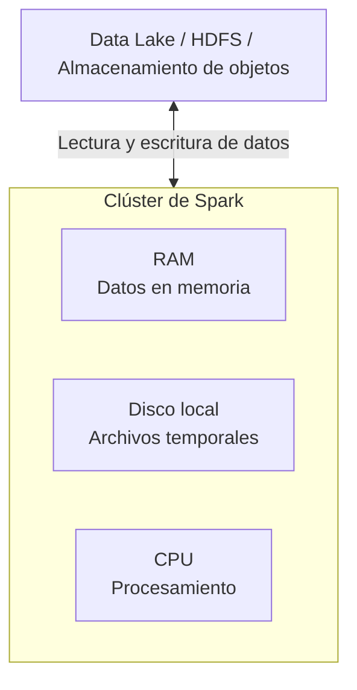

---

### 3.2.4. Clúster, nodos y paralelismo

La distribución entre nodos permite que Spark ejecute diferentes tareas de una aplicación simultáneamente.

Conviene distinguir tres conceptos:

* **Distribución:** el trabajo o los datos se reparten entre diferentes recursos.
* **Paralelismo:** varias tareas se ejecutan simultáneamente.
* **Escalabilidad:** capacidad de aumentar los recursos disponibles para atender cargas de trabajo mayores.

Agregar nodos puede incrementar la capacidad de procesamiento, pero la mejora no siempre es proporcional. Influyen factores como el volumen de datos, el número de particiones, la comunicación entre nodos, la disponibilidad de recursos y las operaciones que requieren redistribuir datos.

---

### Escalado vertical y horizontal

**Escalado vertical (*scale-up*):** aumentar los recursos de una máquina, por ejemplo, añadiendo memoria o utilizando más capacidad de CPU.

**Escalado horizontal (*scale-out*):** incorporar más máquinas al clúster para disponer de recursos adicionales.

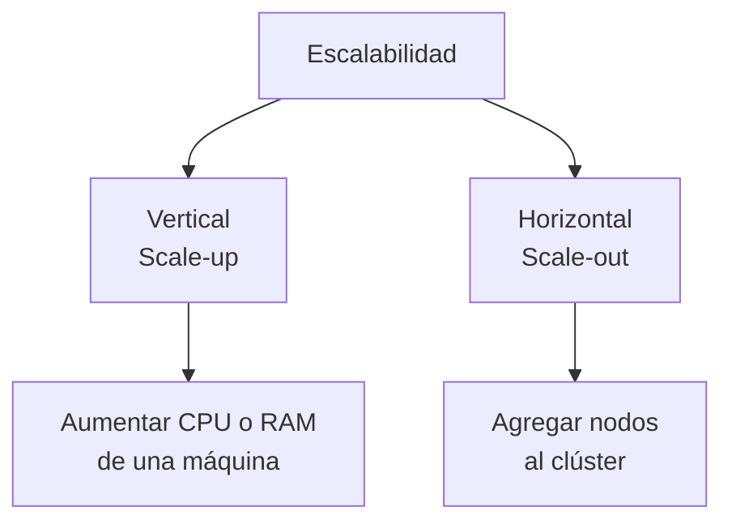

El escalado horizontal es especialmente relevante en el procesamiento distribuido porque permite ampliar la capacidad mediante la incorporación de máquinas. No obstante, el beneficio depende de que la carga de trabajo pueda distribuirse eficientemente.

---

### 3.2.5. Diferencia entre clúster y nodo

| Concepto | Definición                       | Ejemplo                                  |
| -------- | -------------------------------- | ---------------------------------------- |
| Clúster  | Conjunto de máquinas coordinadas | Clúster Spark con varios workers         |
| Nodo     | Una máquina dentro del clúster   | Una máquina virtual con CPU y RAM        |
| CPU      | Procesador de una máquina        | Procesador de 8 cores                    |
| Core     | Unidad de procesamiento          | Un core disponible para ejecutar trabajo |
| RAM      | Memoria principal de la máquina  | 32 GB de memoria                         |

Un clúster no es una única máquina de mayor tamaño: es un conjunto de máquinas cuyos recursos se coordinan para ejecutar cargas de trabajo.

---

## Ideas clave

> * Un **clúster** es un conjunto de máquinas que colaboran en la ejecución de cargas de trabajo.
> * Un **nodo** es una máquina individual que aporta CPU, memoria y otros recursos.
> * Spark distribuye el procesamiento, pero **no combina físicamente todos los recursos** en una sola máquina.
> * La **cantidad de cores** influye en el paralelismo, mientras que la **RAM** influye en la capacidad de mantener datos y estructuras en memoria.
> * El **almacenamiento local** es el espacio disponible en los discos o volúmenes asociados a un nodo. El **almacenamiento de los datos** puede estar separado del clúster de cómputo.
> * Agregar **nodos** puede aumentar la capacidad de procesamiento, pero la mejora depende de la carga de trabajo y de la eficiencia de la distribución.

---

## 3.3. Driver y SparkSession

El **driver** y `SparkSession` son dos conceptos fundamentales para comprender cómo una aplicación interactúa con Apache Spark y coordina su ejecución.

El **driver** es responsable de coordinar la aplicación Spark, mientras que `SparkSession` proporciona el punto de entrada habitual para interactuar con las funcionalidades de Spark, como Spark SQL y trabajar con datos mediante DataFrames.

Aunque están estrechamente relacionados, no son lo mismo.

---

### 3.3.1. Driver

El **driver** es el proceso principal de una aplicación Spark. Se encarga de coordinar su ejecución y organizar el trabajo que posteriormente se distribuye entre los executors.

Entre sus principales responsabilidades se encuentran:

* Mantener la coordinación de la aplicación.
* Interpretar las operaciones declaradas por el programa.
* Participar en la planificación de los jobs y su ejecución.
* Coordinar la distribución de tareas entre los executors.
* Recibir resultados de las operaciones que los devuelven al driver.
* Gestionar el seguimiento de la ejecución de la aplicación.

El driver no tiene que procesar directamente todos los datos. Su función principal es coordinar el procesamiento, mientras que las tareas distribuidas se ejecutan en los executors.

---

### Driver frente a nodos y executors

Es importante distinguir estos componentes:

| Componente | Responsabilidad principal                                                               |
| ---------- | --------------------------------------------------------------------------------------- |
| Clúster    | Conjunto de máquinas que proporcionan recursos para ejecutar aplicaciones distribuidas. |
| Nodo       | Máquina que forma parte de la infraestructura.                                          |
| Driver     | Proceso que coordina una aplicación Spark.                                              |
| Executor   | Proceso que ejecuta tareas y administra recursos asociados a la aplicación.             |

El driver se ejecuta en una máquina o entorno computacional. Según el modo de despliegue, puede encontrarse en un nodo del clúster o en un entorno externo al clúster de workers.

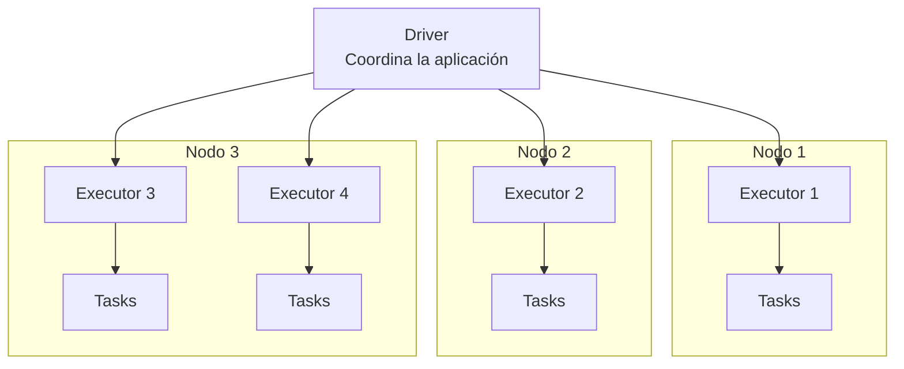

El diagrama representa las relaciones lógicas de coordinación. Los executors ejecutan las tareas asignadas y el driver coordina la planificación y el seguimiento de la aplicación.

---

### 3.3.2. SparkSession

`SparkSession` es el punto de entrada principal para interactuar con las funcionalidades de Saprk, como Spark SQL y trabajar con datos estructurados mediante la API de DataFrames.

A través de este objeto podemos, por ejemplo:

* Leer datos desde archivos y fuentes compatibles.
* Crear y manipular DataFrames.
* Ejecutar consultas SQL.
* Registrar vistas temporales.
* Acceder a configuraciones relacionadas con Spark SQL.

En PySpark, normalmente utilizamos una variable llamada `spark` para referirnos al objeto `SparkSession`.

---

### Crear o recuperar una SparkSession

```python
from pyspark.sql import SparkSession

spark = (
    SparkSession.builder
    .appName("SparkLearning")
    .getOrCreate()
)
```

En este ejemplo:

* `SparkSession.builder` permite configurar la creación de la sesión.
* `.appName("SparkLearning")` establece el nombre de la aplicación.
* `.getOrCreate()` recupera una sesión existente compatible con el contexto o crea una nueva cuando corresponde.

El objeto resultante se asigna a la variable `spark`.

> **Importante:** la variable `spark` no es el clúster ni el driver. Es una referencia al objeto `SparkSession` que utilizamos desde nuestro código.

---

### Ejemplo de uso

```python
df = spark.read.parquet("data/customers.parquet")

df.show(5)
```

En este ejemplo:

1. `spark.read.parquet(...)` utiliza la sesión para leer los datos y obtener un DataFrame.
2. `df.show(5)` solicita mostrar cinco filas.
3. Spark ejecuta las operaciones necesarias para producir esa salida.

La ejecución real depende de la fuente de datos, el plan de ejecución y el entorno de despliegue.

---

### 3.3.3. ¿Cómo se relacionan el driver y SparkSession?

En una aplicación PySpark, el código Python interactúa habitualmente con Spark mediante `SparkSession`. El driver coordina la aplicación y participa en la planificación y ejecución de los trabajos.

De forma conceptual:

1. El programa obtiene una `SparkSession`.
2. El código define operaciones sobre los datos.
3. Spark prepara y optimiza el plan de ejecución cuando corresponde.
4. Cuando una operación requiere ejecutar el trabajo, el driver coordina su ejecución.
5. Los executors procesan las tareas distribuidas.
6. Los resultados se devuelven al driver, se escriben en un destino o se materializan según la operación.

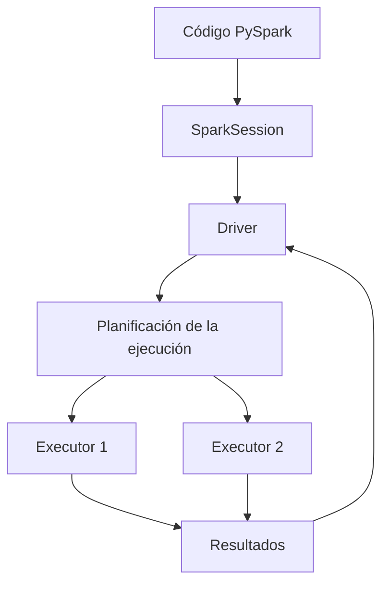

Este diagrama es una simplificación conceptual. `SparkSession` no es un proceso que se encuentre entre el código Python y el driver: es un objeto de la API utilizado desde la aplicación. En un despliegue típico de PySpark, el código Python del driver y los componentes de coordinación de Spark colaboran para ejecutar el trabajo.

---

### 3.3.4. Diferencias clave

| Aspecto                | Driver                                     | SparkSession                                                                      |
| ---------------------- | ------------------------------------------ | --------------------------------------------------------------------------------- |
| Naturaleza             | Proceso de la aplicación Spark.            | Objeto de la API de Spark.                                                        |
| Función principal      | Coordinar la ejecución de la aplicación.   | Proporcionar un punto de entrada para interactuar con funcionalidades como Spark SQL y DataFrames.     |
| Relación con el código | Ejecuta o coordina la aplicación.          | Se utiliza desde el código para declarar operaciones y acceder a funcionalidades. |
| Ejemplo                | Proceso que organiza la ejecución de jobs. | `spark`, creado u obtenido mediante `SparkSession.builder`                       |

---

## Ideas clave

> * El **driver** coordina la ejecución de una aplicación Spark.
> * Los **executors** ejecutan las tareas distribuidas.
> * `SparkSession` es el **punto de entrada** habitual para trabajar con funcionalidades como Spark SQL y DataFrames desde PySpark.
> * La variable `spark` suele contener una referencia al objeto `SparkSession`.
> * `SparkSession` no es el driver, aunque su uso está ligado al contexto de ejecución de la aplicación.
> * La ubicación del **driver** depende del modo de despliegue.

---

## 3.4. Executors, cores y recursos de ejecución

En Apache Spark, el **procesamiento distribuido** requiere asignar recursos computacionales a una aplicación y utilizarlos para ejecutar tareas en paralelo.

Los **executors** son procesos que ejecutan tareas y administran recursos asociados a una aplicación Spark. Los **cores** representan la capacidad de procesamiento disponible, mientras que la **memoria** permite mantener datos y estructuras necesarias durante la ejecución.

Para comprender cómo Spark utiliza los recursos, debemos distinguir entre los procesos que ejecutan el trabajo, los recursos asignados y las unidades de trabajo que se procesan.

---

### 3.4.1. Executors

Un **executor** es un proceso que se ejecuta en un nodo del clúster y participa en el procesamiento de una aplicación Spark.

Sus principales responsabilidades son:

* Ejecutar las tasks que le asigna el driver.
* Procesar particiones de datos.
* Mantener datos en memoria o en almacenamiento local cuando corresponde.
* Gestionar recursos utilizados por las tareas.
* Informar al driver sobre el progreso y los resultados de la ejecución.

Cada executor dispone de recursos asignados, principalmente cores de CPU y memoria.

Una aplicación Spark puede utilizar varios executors distribuidos entre diferentes nodos. Además, un nodo puede alojar varios executors si dispone de recursos suficientes y la configuración lo permite.

---

### Ejemplo conceptual


El diagrama representa una aplicación con cuatro executors distribuidos entre tres nodos.

---

### 3.4.2. Cores y capacidad de procesamiento

Un **core** es una unidad de procesamiento de la CPU capaz de ejecutar instrucciones. En Spark, el número de cores asignados a los executors influye en cuántas tasks pueden ejecutarse simultáneamente.

En la configuración habitual, cada task en ejecución utiliza un core asignado al executor. Por tanto, si una aplicación dispone de ocho cores utilizables para sus executors, puede ejecutar aproximadamente ocho tasks al mismo tiempo, siempre que haya suficientes tasks disponibles y no existan otras limitaciones.

---

#### Ejemplo

Supongamos que una aplicación dispone de dos executors, cada uno con dos cores asignados.

| Recurso                    | Executor 1 | Executor 2 | Total |
| -------------------------- | ---------: | ---------: | ----: |
| Cores asignados            |          2 |          2 |     4 |
| Tasks simultáneas posibles |          2 |          2 |     4 |

En este escenario, la aplicación puede ejecutar hasta cuatro tasks simultáneamente bajo la configuración habitual de una task por core.

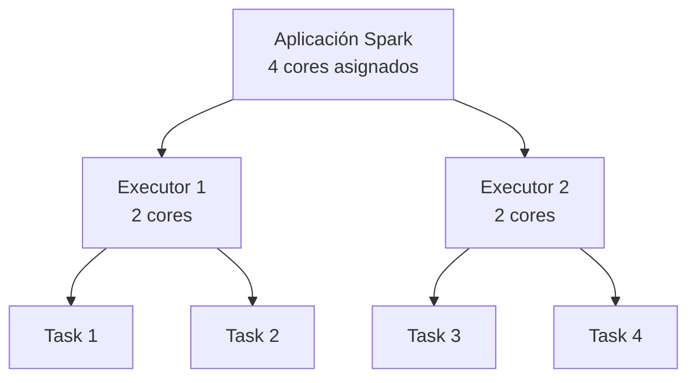

El número de cores limita el paralelismo de las tasks, pero no determina por sí solo la duración de la aplicación. También influyen la cantidad de datos, el tipo de operación, la memoria disponible y la comunicación entre nodos.

---

### 3.4.3. Memoria de los executors

La memoria es otro recurso fundamental para ejecutar una aplicación Spark.

Los executors utilizan memoria para mantener datos y estructuras de trabajo durante el procesamiento. Entre otros usos, puede emplearse para:

* Almacenar datos persistidos o en caché.
* Mantener estructuras intermedias de operaciones.
* Ejecutar agregaciones y operaciones de combinación.
* Gestionar los objetos necesarios para procesar las tasks.

La memoria disponible depende de la configuración de la aplicación, los límites del entorno y los recursos que comparte el nodo con otros procesos.

Si una operación necesita más memoria de la disponible, puede generar presión de memoria, recurrir a disco cuando la operación lo permite o fallar por falta de recursos.

---

### Memoria del nodo frente a memoria del executor

Estos conceptos no son equivalentes:

* **Memoria del nodo:** RAM total disponible en la máquina.
* **Memoria del executor:** memoria asignada al proceso executor, de acuerdo con la configuración de Spark y el entorno de despliegue.

Por ejemplo, una máquina con 64 GB de RAM no implica que cada executor pueda utilizar 64 GB. Parte de la memoria puede estar reservada para el sistema operativo, otros procesos y otros executors.

---

### 3.4.4. Relación entre executors, cores y tasks

Para entender el paralelismo en Spark, debemos relacionar tres conceptos:

* **Executor:** proceso que ejecuta tareas.
* **Core asignado:** capacidad de procesamiento disponible para ejecutar tareas concurrentes.
* **Task:** unidad de trabajo que procesa una partición dentro de un stage.

En una configuración habitual, un executor con cuatro cores asignados puede ejecutar hasta cuatro tasks simultáneamente.

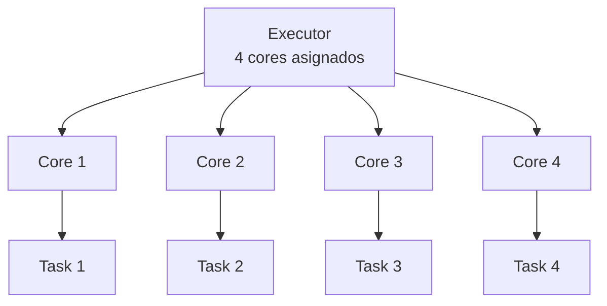

El diagrama muestra un ejemplo conceptual. La relación entre cores y tasks depende de la configuración y de las características de la carga de trabajo.

---

### 3.4.5. Relación entre tasks y particiones

Una **partición** es una división lógica de los datos que Spark puede procesar de forma distribuida.

Una **task** es una unidad de trabajo que procesa una partición para un stage determinado.

Por tanto, las particiones y las tasks están relacionadas, pero no son lo mismo:

* La **partición** representa cómo se dividen los datos.
* La **task** representa el trabajo que se ejecuta sobre una partición en un stage.

En general, un stage genera una task por cada partición que debe procesar. Si un stage tiene ocho particiones, normalmente tendrá ocho tasks.

Sin embargo, no todas las tasks se ejecutan simultáneamente. El paralelismo disponible depende de los cores asignados y de los recursos de la aplicación.

---

### Ejemplo

Supongamos que un stage debe procesar ocho particiones y que la aplicación dispone de cuatro cores utilizables para las tasks.

* Hay ocho tasks por ejecutar.
* Pueden ejecutarse hasta cuatro simultáneamente.
* Cuando terminan algunas tasks, Spark puede iniciar las restantes.

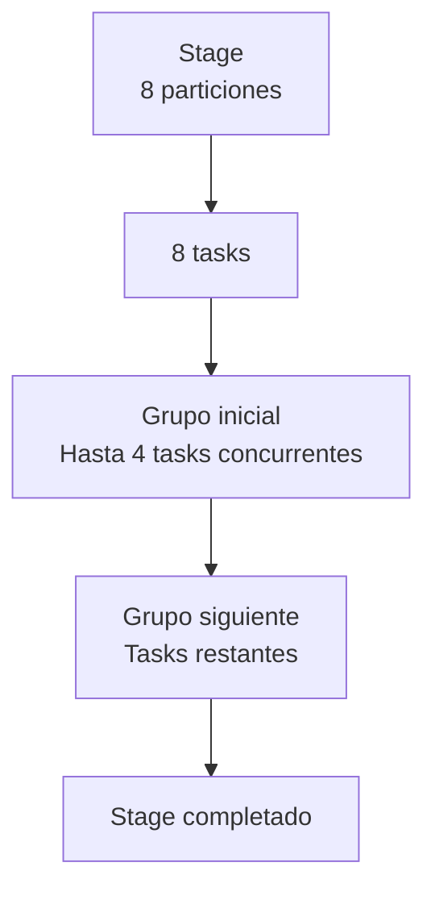

### 3.4.6. Ejemplo integrado: distribución de recursos

Consideremos una aplicación con esta configuración hipotética:

* Tres nodos de trabajo.
* Dos executors en cada nodo.
* Dos cores asignados a cada executor.
* Doce cores asignados en total a los executors.

El cálculo del paralelismo potencial es:

$$
3\ \text{nodos}
\times
2\ \text{executors por nodo}
\times
2\ \text{cores por executor}
=
12\ \text{cores}
$$

Bajo la configuración habitual de una task por core, la aplicación podría ejecutar hasta doce tasks simultáneamente.

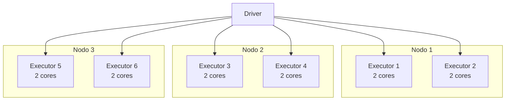

Este ejemplo supone que todos los recursos están disponibles para la aplicación. En un clúster real, la cantidad de executors y cores depende de la configuración, de la asignación del administrador de recursos y de las limitaciones de cada nodo.

### 3.4.7. ¿Más executors siempre significan mayor rendimiento?

No necesariamente. Agregar executors o cores puede aumentar el paralelismo disponible, pero el rendimiento depende de cómo se distribuye y ejecuta el trabajo.

Algunos factores relevantes son:

* **Volumen de datos:** cuánto trabajo debe procesarse.
* **Número de particiones:** cuántas tasks puede generar un stage.
* **Memoria disponible:** si las operaciones caben en los recursos asignados.
* **Comunicación entre nodos:** cuánto intercambio de datos requiere el trabajo.
* **Costes de coordinación:** la planificación y gestión de tasks también consumen recursos.
* **Cuellos de botella:** ciertas operaciones pueden limitar el rendimiento independientemente de los recursos añadidos.

Por ejemplo, si un stage tiene únicamente dos particiones, disponer de veinte cores no implica que ese stage pueda mantener veinte tasks ocupadas simultáneamente.

> La asignación eficiente de recursos requiere equilibrar la cantidad de trabajo, las particiones y la capacidad computacional.

### Ideas clave

> * Los **executors** son procesos que ejecutan tasks y administran recursos asociados a una aplicación Spark.
> * Los **cores** asignados a los executors determinan parte de la capacidad de ejecución concurrente.
> * La **memoria** del executor no equivale a toda la RAM del nodo.
> * Las **particiones** representan divisiones de los datos; las tasks procesan esas particiones en un stage.
> * Un **stage** puede tener más tasks que cores disponibles, por lo que las tasks se ejecutan en varias tandas.
> * Añadir **recursos** puede mejorar el rendimiento, pero no garantiza una aceleración proporcional.

---

## 3.5. Particiones y distribución de los datos

Las **particiones** son uno de los conceptos fundamentales de Apache Spark porque conectan la organización de los datos con el **paralelismo del procesamiento distribuido**.

Spark divide los datos en particiones para poder procesar diferentes partes de un conjunto de datos de forma independiente y, cuando existen recursos suficientes, simultánea.

Comprender las particiones permite entender cómo se distribuye el trabajo entre los executors, por qué una aplicación puede no aprovechar todos los recursos disponibles y cómo determinadas operaciones redistribuyen los datos.

---

### 3.5.1. ¿Qué es una partición?

Una **partición** es una división lógica de un conjunto de datos distribuido que Spark puede procesar como parte de una operación.

Un **DataFrame o RDD** puede estar compuesto por múltiples particiones. Cada una contiene una parte de los datos y puede procesarse mediante una task durante un stage.

Por ejemplo, supongamos que tenemos un dataset de un millón de registros y lo dividimos en cuatro particiones de aproximadamente 250,000 registros cada una.

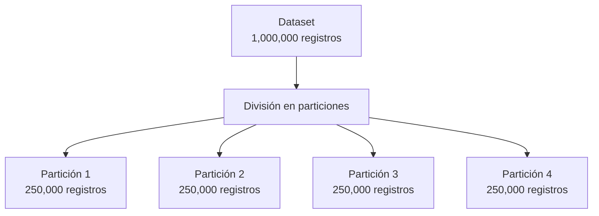

> **Importante:** una partición no es necesariamente un archivo, una máquina ni un executor. Es una división lógica de los datos que Spark utiliza para organizar el procesamiento.

Las particiones no necesariamente contienen la misma cantidad de registros. Su tamaño depende de cómo se distribuyan los datos y de las operaciones realizadas.

---

### 3.5.2. ¿Para qué sirven las particiones?

Las particiones permiten dividir el trabajo en unidades que pueden procesarse de forma independiente.

Sus principales funciones son:

* **Paralelismo:** diferentes particiones pueden procesarse simultáneamente.
* **Distribución del trabajo:** las tasks pueden ejecutarse en diferentes executors y nodos.
* **Escalabilidad:** el trabajo puede distribuirse entre los recursos disponibles.
* **Gestión del procesamiento:** Spark organiza las tareas a partir de las particiones que necesita procesar cada stage.

Sin particiones, Spark no tendría esta misma forma de dividir el procesamiento distribuido en unidades de trabajo independientes.

---

### 3.5.3. Relación entre particiones, tasks, executors y cores

Estos conceptos están relacionados, pero cada uno cumple una función distinta.

| Concepto      | Qué representa                                                        |
| ------------- | --------------------------------------------------------------------- |
| Partición     | División lógica de los datos.                                         |
| Task          | Unidad de trabajo que procesa una partición durante un stage.         |
| Executor      | Proceso que ejecuta tasks.                                            |
| Core asignado | Recurso de procesamiento que permite ejecutar tasks concurrentemente. |
| Nodo          | Máquina que proporciona recursos computacionales.                     |

En general, **cada partición que debe procesarse en un stage da lugar a una task**. Por eso, el número de particiones que procesa un stage suele determinar cuántas tasks debe ejecutar.

Supongamos que un stage tiene ocho particiones y que la aplicación dispone de cuatro cores utilizables para las tasks.

* Se generan normalmente ocho tasks para ese stage.
* Pueden ejecutarse hasta cuatro tasks simultáneamente, bajo la configuración habitual de una task por core.
* Cuando algunas tasks terminan, los recursos pueden utilizarse para ejecutar las restantes.

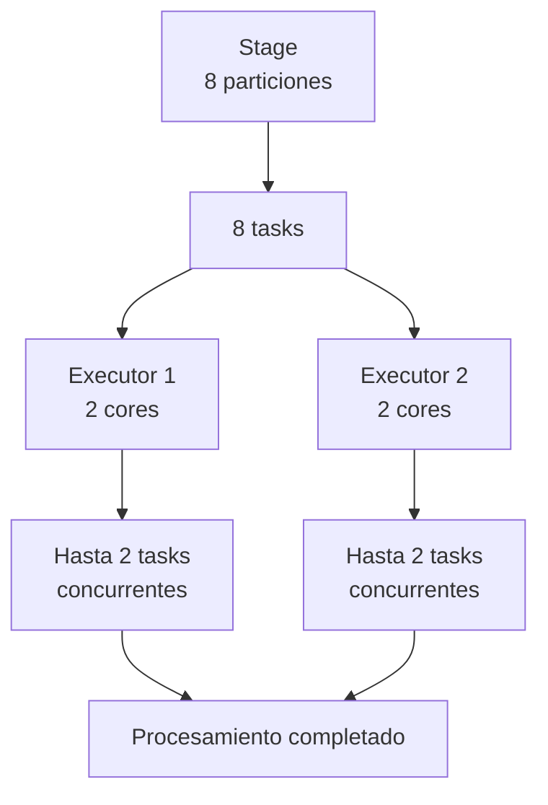

Además, el número de tasks puede variar entre stages: una operación que redistribuye los datos puede cambiar el número de particiones que procesa una etapa posterior.

---

### 3.5.4. ¿Cómo se distribuyen las particiones entre los nodos?

Cuando Spark ejecuta un stage, el driver coordina la planificación de las tasks y los executors disponibles ejecutan el trabajo.

Las particiones no tienen que asignarse permanentemente a un nodo específico. En muchos casos, Spark puede programar las tasks en diferentes executors según los recursos disponibles y las preferencias de ubicación de los datos.

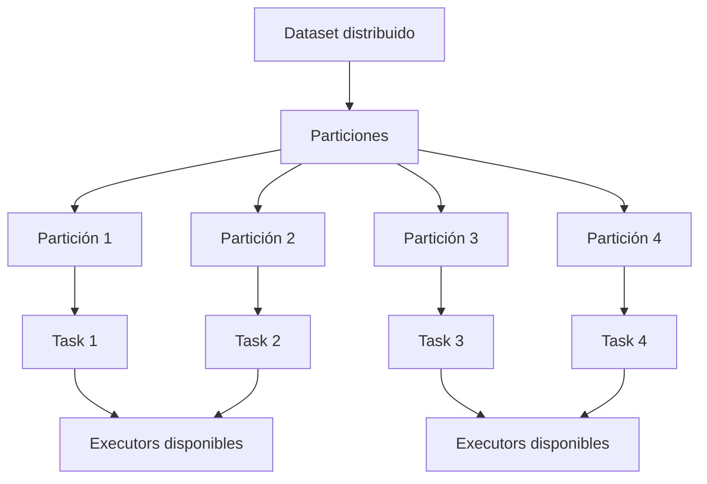

Es importante distinguir dos ideas:

* **Distribución lógica:** los datos se organizan en particiones.
* **Ejecución física:** las tasks que procesan esas particiones se ejecutan en los executors que disponen de recursos.

> Una partición puede procesarse en un executor diferente en ejecuciones distintas. No se debe asumir que una partición siempre pertenece al mismo nodo.

### 3.5.5. ¿De dónde salen las particiones?

El número y la distribución de las particiones dependen de cómo se crean o leen los datos y de las operaciones que se aplican posteriormente.

Entre los factores principales se encuentran:

* **Fuente de datos:** la lectura de archivos puede generar particiones según su formato, tamaño, distribución y configuración de lectura.
* **Paralelismo de entrada:** algunos orígenes permiten controlar cómo se divide el trabajo inicial.
* **Operaciones de redistribución:** determinadas operaciones reorganizan los datos y pueden cambiar el número de particiones.
* **Configuración de Spark:** ciertos parámetros influyen en la cantidad de particiones utilizadas por algunas operaciones.
* **Optimizaciones de ejecución:** el optimizador y la ejecución adaptativa pueden modificar determinados aspectos del plan y de la distribución.

Por tanto, el número de particiones no siempre se define manualmente. Spark puede determinarlo a partir de la fuente de datos, las operaciones y la configuración.

### 3.5.6. ¿Qué sucede cuando hay demasiadas o muy pocas particiones?

El número de particiones influye en el paralelismo y en los costes de ejecución.

#### Muy pocas particiones

Si una aplicación tiene pocos cores disponibles y muchas particiones, puede ejecutar las tasks en varias tandas. Pero si tiene muchos cores y muy pocas particiones, parte de la capacidad de procesamiento podría quedar sin aprovechar.

Por ejemplo, si un stage tiene dos particiones y la aplicación dispone de dieciséis cores, normalmente habrá como máximo dos tasks de ese stage ejecutándose simultáneamente.

#### Demasiadas particiones

Tener muchas particiones puede incrementar los costes de planificación y coordinación, especialmente cuando cada una contiene muy poco trabajo.

Sin embargo, aumentar el número de particiones también puede ser beneficioso cuando permite distribuir mejor una carga de trabajo grande.

No existe un número de particiones óptimo para todas las aplicaciones. Depende del tamaño de los datos, la complejidad de las operaciones, los recursos disponibles y el comportamiento de la carga de trabajo.

### 3.5.7. Redistribución de los datos: repartition y coalesce

Durante el procesamiento, Spark puede modificar cómo se dividen los datos entre particiones.

Dos operaciones conocidas son `repartition()` y `coalesce()`.

#### repartition()

Permite cambiar el número de particiones de un DataFrame. Generalmente implica una redistribución de los datos entre particiones (*shuffle*), lo que puede requerir comunicación entre executors.

```python
df_repartitioned = df.repartition(8)
```

En este ejemplo, se solicita un DataFrame con ocho particiones. La redistribución puede ayudar a incrementar el paralelismo o equilibrar el trabajo, pero también tiene un coste.

#### coalesce()

Permite reducir el número de particiones de un DataFrame, normalmente evitando una redistribución completa de los datos cuando se utiliza de la forma habitual.

```python
df_coalesced = df.coalesce(4)
```

En este ejemplo, se solicita reducir el DataFrame a cuatro particiones. La distribución resultante puede no ser perfectamente equilibrada.

La elección entre ambas operaciones depende del objetivo: `repartition()` puede ser útil para redistribuir los datos, mientras que `coalesce()` suele ser útil para reducir particiones con menos movimiento de datos.

---

### 3.5.8. Particiones y archivos: ¿son lo mismo?

No. Una partición de Spark y un archivo físico son conceptos diferentes.

Al leer datos, Spark puede dividir archivos grandes en varias particiones de lectura o procesar varios archivos mediante una partición, dependiendo de la fuente y de la configuración.

Del mismo modo, al escribir datos, la cantidad de archivos generados puede depender de las particiones de salida y de las opciones de escritura.

Por ejemplo, escribir un DataFrame con varias particiones puede generar varios archivos de salida, pero no se debe asumir que siempre habrá una correspondencia exacta entre una partición y un archivo.

Esta distinción es importante al trabajar con formatos como Parquet y con sistemas de almacenamiento como HDFS o almacenamiento de objetos.

### Ideas clave

> * Una **partición** es una división lógica de los datos que permite organizar el procesamiento distribuido.
> * Las **tasks** procesan particiones durante un stage.
> * Los **executors** ejecutan las tasks utilizando los recursos asignados.
> * El número de particiones influye en el paralelismo disponible, pero no equivale al número de cores.
* Una aplicación puede tener más tasks que cores y ejecutarlas en varias tandas.
* Las operaciones de redistribución pueden cambiar el número y la distribución de las particiones.
* Las particiones de Spark no equivalen necesariamente a archivos físicos ni a nodos del clúster.

## 3.6. Jobs, stages y tasks

Apache Spark organiza la ejecución de las operaciones distribuidas mediante una jerarquía de unidades de trabajo:

**Job → Stage → Task**

Esta organización permite dividir el procesamiento en etapas y distribuir las tareas entre los executors disponibles en el clúster.

Aunque estos conceptos están relacionados, representan distintos niveles de ejecución.

---

### 3.6.1 Jobs

Un **job** es una unidad de trabajo que Spark genera para ejecutar un conjunto de operaciones necesarias para producir un resultado.

En el modelo clásico de Spark, los jobs suelen originarse cuando una acción requiere ejecutar transformaciones que anteriormente habían sido definidas.

Por ejemplo:

```python
df = spark.read.parquet("data/customers.parquet")

df_filtered = df.filter(df.age > 30)

result = df_filtered.count()
```

En este ejemplo:

1. `spark.read.parquet()` define la lectura de los datos.
2. `filter()` define una transformación.
3. `count()` solicita un resultado y desencadena la ejecución necesaria.

Spark construye y ejecuta el trabajo requerido para calcular el número de registros.

> **Importante:** no existe una correspondencia estricta de una acción por job. Una acción puede generar varios jobs dependiendo de la operación, el plan de ejecución y las optimizaciones aplicadas.

---

### 3.6.2 Stages

Un **stage** es una etapa de ejecución dentro de un job.

Spark divide los jobs en stages de acuerdo con las dependencias entre las operaciones, especialmente cuando es necesario redistribuir datos entre particiones.

Dentro de un mismo stage, Spark puede ejecutar una secuencia de operaciones sin requerir una redistribución global de datos entre executors.

Por ejemplo:

```python
df_filtered = df.filter(df.age > 30)

df_selected = df_filtered.select("city", "income")
```

Las operaciones `filter()` y `select()` pueden formar parte de un mismo stage, porque normalmente pueden procesarse sobre las particiones existentes sin redistribuir los datos.

Sin embargo, algunas operaciones necesitan reorganizar los registros entre particiones.

Por ejemplo:

```python
df_grouped = df.groupBy("city").count()
```

Para agrupar todos los registros de una misma ciudad, Spark puede necesitar mover datos entre particiones y executors.

Este intercambio, como vimos anteriormente, se denomina **shuffle**.

---

#### Shuffle

Durante un shuffle, Spark puede escribir, transferir y leer datos intermedios para reorganizarlos.

Los shuffles son importantes porque pueden introducir costos adicionales de comunicación, memoria, disco y procesamiento.

En términos generales, **los límites entre stages suelen aparecer cuando existe una dependencia de shuffle**.

Esto no significa que cada transformación genere un stage independiente.

---

#### Ejemplo conceptual

Supongamos que queremos calcular el número de clientes por ciudad:

```python
result = (
    df.filter(df.age > 30)
      .groupBy("city")
      .count()
)

result.show()
```

Una posible organización simplificada sería:

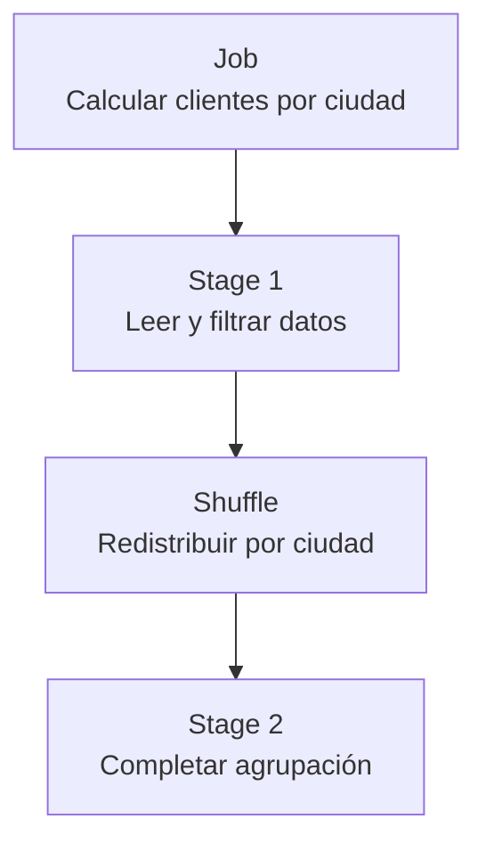

En el primer stage se procesan las particiones de entrada y se preparan los datos para la agrupación.

Después del shuffle, el siguiente stage procesa las particiones resultantes y completa la agregación.

---

### 3.6.3 Tasks

Una **task** es la unidad de ejecución más pequeña que Spark programa dentro de un stage.

Cada task ejecuta el trabajo correspondiente a una partición de datos para ese stage.

Las tasks son enviadas a los executors, donde utilizan los recursos de procesamiento disponibles.

Por ejemplo, si un stage tiene ocho particiones, normalmente Spark genera ocho tasks para procesarlas.

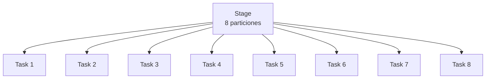

Si los executors disponen de cuatro cores asignados para ejecutar tasks, normalmente podrán procesar hasta cuatro tasks simultáneamente.

Las demás esperarán hasta que existan recursos disponibles.

> El número de particiones determina la cantidad de tasks de un stage, mientras que los recursos de los executors condicionan cuántas pueden ejecutarse al mismo tiempo.

**Una task no equivale a un executor.** Un executor puede ejecutar múltiples tasks, simultáneamente o de manera sucesiva.

---

### 3.6.4 Relación entre jobs, stages y tasks

La jerarquía completa puede representarse de la siguiente manera:

```mermaid
flowchart TD
    J["Job"]

    J --> S1["Stage 1"]
    J --> S2["Stage 2"]

    S1 --> T1["Task 1"]
    S1 --> T2["Task 3"]
    S1 --> T3["Task 2"]

    S2 --> T4["Task 2"]
    S2 --> T5["Task 1"]

    T1 --> E1["Executor 1"]
    T2 --> E2["Executor 2"]
    T3 --> E1
    T4 --> E2
    T5 --> E1
```

En este ejemplo:

- El job está dividido en dos stages.
- El primer stage contiene tres tasks.
- El segundo stage contiene dos tasks.
- Las tasks son ejecutadas por los executors disponibles.

Los stages tienen sus propias tasks. Los stages con dependencias deben respetar el orden necesario para que sus datos estén disponibles. Los stages independientes pueden ejecutarse en paralelo cuando el plan y los recursos lo permiten.

> Los Executors son procesos persistentes durante la ejecución de una aplicación Spark. Un mismo Executor puede ejecutar Tasks pertenecientes a diferentes Stages a medida que el Driver las va programando. Sin embargo, cada Task pertenece únicamente a un Stage específico y no puede formar parte simultáneamente de varios Stages.

---

### 3.6.5 Ejemplo integrado: particiones, stages y executors

Supongamos que tenemos un DataFrame distribuido en ocho particiones y queremos calcular el número de registros por categoría:

```python
df = spark.read.parquet("data/sales.parquet")

df = df.repartition(8)

result = df.groupBy("category").count()

result.show()
```

Para simplificar, consideremos únicamente la agrupación después de disponer de las ocho particiones. La operación `repartition(8)` también puede introducir un shuffle y etapas adicionales.

Una ejecución posible de la agrupación sería:

**Stage 1: procesamiento previo al shuffle**

Spark procesa las ocho particiones existentes y prepara agregaciones parciales.

| Partición | Task |
|---|---|
| Partición 1 | Task 1 |
| Partición 2 | Task 2 |
| Partición 3 | Task 3 |
| Partición 4 | Task 4 |
| Partición 5 | Task 5 |
| Partición 6 | Task 6 |
| Partición 7 | Task 7 |
| Partición 8 | Task 8 |

Se generan ocho tasks para este stage.

Si tenemos dos executors con dos cores asignados cada uno:

| Executor | Cores asignados | Tasks simultáneas habituales |
|---|---:|---:|
| Executor 1 | 2 | 2 |
| Executor 2 | 2 | 2 |
| **Total** | **4** | **4** |

Las ocho tasks pueden procesarse en aproximadamente dos tandas, suponiendo duraciones similares y recursos disponibles.

**Stage 2: procesamiento posterior al shuffle**

Spark redistribuye los datos por categoría y ejecuta nuevas tasks sobre las particiones resultantes.

El número de particiones del segundo stage no necesariamente será ocho. Puede depender de la configuración de shuffle y de las optimizaciones adaptativas de Spark.

Esto demuestra que:

- Las particiones pueden cambiar entre stages.
- Cada stage tiene su propio conjunto de tasks.
- Los executors pueden procesar tasks de diferentes stages durante la ejecución de la aplicación.
- La cantidad de tasks y la concurrencia disponible son conceptos distintos.

---

### 3.6.6 Diferencias entre job, stage y task

| Concepto | Definición | Función |
|---|---|---|
| **Job** | Unidad de trabajo generada para obtener un resultado | Organizar la ejecución requerida |
| **Stage** | Conjunto de tasks con dependencias compatibles | Dividir el job en etapas ejecutables |
| **Task** | Unidad de ejecución asociada a una partición dentro de un stage | Procesar datos en un executor |

---

### Ideas clave

> 1. **Job → Stage → Task** representa la jerarquía de ejecución distribuida de Spark.
> 2. Un **job** puede contener uno o varios stages.
> 3. Un **stage** contiene múltiples tasks, normalmente una por partición del stage.
> 4. Las **tasks** se ejecutan en los **executors** utilizando los recursos asignados.
> 5. Los **shuffles** suelen determinar los límites entre stages.
> 6. El **número de particiones** influye en el paralelismo disponible.
> 7. El **número de cores** asignados a los executors condiciona la cantidad de tasks que pueden ejecutarse simultáneamente.
> 8. Los **stages** no necesariamente tienen el mismo número de particiones o tasks.

En conjunto, esta jerarquía explica cómo Spark convierte operaciones de alto nivel, como filtros, agrupaciones y joins, en unidades de trabajo que pueden distribuirse y ejecutarse en un clúster.

---

## 3.7. Lazy Evaluation y planificación de la ejecución

Apache Spark utiliza un modelo de **evaluación diferida (*Lazy Evaluation*)**, mediante el cual muchas operaciones sobre los datos no se ejecutan inmediatamente cuando se definen.

En su lugar, Spark construye una representación del procesamiento solicitado y pospone su ejecución hasta que sea necesario obtener un resultado.

Este comportamiento permite analizar y optimizar las operaciones antes de distribuir el trabajo entre los executors.

---

### 3.7.1. ¿Qué es Lazy Evaluation?

**Lazy Evaluation** es una estrategia de ejecución en la que Spark retrasa el procesamiento de las transformaciones hasta que una operación requiere materializar o producir un resultado.

Por ejemplo:

```python
df = spark.read.parquet("data/customers.parquet")

df_filtered = df.filter(df.age > 30)

df_selected = df_filtered.select("customer_id", "city")
```

En este código:

1. Se define un DataFrame a partir de un archivo Parquet.
2. Se define un filtro para seleccionar clientes mayores de 30 años.
3. Se define una selección de columnas.

Estas instrucciones construyen una representación de las operaciones, pero no necesariamente procesan los registros del archivo en ese momento.

Spark conserva la información necesaria para ejecutar el procesamiento posteriormente.

Cuando solicitamos un resultado:

```python
df_selected.show()
```

Spark ejecuta las operaciones necesarias para mostrar los registros solicitados.

> Lazy Evaluation no significa que ninguna instrucción realice trabajo inmediato. Spark puede acceder a metadatos, consultar esquemas o realizar determinadas operaciones auxiliares antes de ejecutar el procesamiento principal.

---

### 3.7.2. Transformaciones y acciones

Para comprender Lazy Evaluation es necesario distinguir dos tipos de operaciones.

---

#### Transformaciones

Las **transformaciones** definen operaciones que producen un nuevo DataFrame o RDD a partir de otro.

Generalmente son evaluadas de forma diferida.

Algunos ejemplos en la API de DataFrames son:

| Transformación | Función |
|---|---|
| `select()` | Seleccionar columnas |
| `filter()` | Filtrar registros |
| `withColumn()` | Crear o modificar columnas |
| `groupBy().agg()` | Definir agregaciones |
| `join()` | Combinar DataFrames |
| `repartition()` | Redistribuir particiones |
| `orderBy()` | Definir un ordenamiento |

Ejemplo:

```python
df_result = (
    df.filter(df.age > 30)
      .select("customer_id", "city", "income")
      .orderBy("income")
)
```

Estas operaciones describen el resultado que se desea obtener.

No es necesario que Spark ejecute cada transformación de forma independiente conforme aparece en el código.

---

#### Acciones

Las **acciones** solicitan que Spark ejecute el procesamiento necesario para producir, recuperar o guardar resultados.

Ejemplos:

| Acción u operación de salida | Función |
|---|---|
| `show()` | Mostrar registros |
| `count()` | Contar registros |
| `collect()` | Recuperar resultados en el driver |
| `take()` | Recuperar un número determinado de registros |
| `first()` | Obtener el primer registro |
| `write.parquet()` | Escribir datos en formato Parquet |

Ejemplo:

```python
df_result.count()
```

Spark ejecuta el trabajo necesario para calcular el número de registros.

Otro ejemplo:

```python
df_result.write.mode("overwrite").parquet("output/customers")
```

Spark ejecuta el procesamiento requerido para generar los archivos de salida.

---

### 3.7.3. DAG: Directed Acyclic Graph

Spark representa las dependencias entre operaciones mediante estructuras que pueden modelarse como un **DAG (*Directed Acyclic Graph*)**, o grafo dirigido acíclico.

Un DAG está compuesto por:

- **Nodos:** representan operaciones o unidades de trabajo.
- **Aristas:** representan relaciones de dependencia.
- **Dirección:** indica cómo se relacionan las operaciones.
- **Ausencia de ciclos:** las dependencias no forman ciclos cerrados.

Por ejemplo:

```python
df_result = (
    df.filter(df.age > 30)
      .select("city", "income")
      .groupBy("city")
      .avg("income")
)
```

Podemos representar conceptualmente las dependencias de las operaciones:

```mermaid
flowchart TD
    A["Lectura de datos"]
    B["Filter<br/>age > 30"]
    C["Select<br/>city, income"]
    D["GroupBy<br/>city"]
    E["Average<br/>income"]

    A --> B
    B --> C
    C --> D
    D --> E
```

Este grafo representa el procesamiento lógico solicitado.

Spark puede utilizar las dependencias entre operaciones para determinar cómo organizar el trabajo.

> **Distinción importante:** el DAG de operaciones no debe confundirse con el DAG de stages que Spark utiliza para programar la ejecución. Son representaciones relacionadas, pero corresponden a distintos niveles de planificación.

---

### 3.7.4. Planificación de la ejecución en Spark SQL

Cuando trabajamos con DataFrames o consultas SQL, Spark utiliza un proceso de planificación que transforma las operaciones declaradas en instrucciones ejecutables.

De manera conceptual, este proceso comprende:

1. Construcción de un plan lógico.
2. Análisis y resolución del plan.
3. Optimización lógica.
4. Generación y selección de un plan físico.
5. Ejecución distribuida.

```mermaid
flowchart TD
    A["Código PySpark<br/>DataFrame API o SQL"]
    B["Plan lógico inicial"]
    C["Plan lógico analizado"]
    D["Plan lógico optimizado"]
    E["Plan físico"]
    F["Ejecución distribuida<br/>Jobs, stages y tasks"]

    A --> B
    B --> C
    C --> D
    D --> E
    E --> F
```

Esta representación corresponde principalmente al procesamiento estructurado mediante **Spark SQL**, que incluye las operaciones sobre DataFrames.

Las operaciones de bajo nivel con RDD siguen mecanismos de planificación diferentes y no pasan necesariamente por Catalyst.

---

### 3.7.5. Catalyst Optimizer

**Catalyst** es el framework de análisis y optimización de consultas utilizado por Spark SQL.

Su objetivo es transformar las operaciones declaradas en planes de ejecución eficientes, preservando su semántica.

Catalyst participa en el análisis de expresiones, resolución de referencias, optimización lógica y planificación física.

Entre las optimizaciones más conocidas se encuentran:

**Predicate Pushdown**

Consiste en intentar aplicar filtros lo antes posible, incluso delegándolos a la fuente de datos cuando esta lo permite.

Ejemplo:

```python
df = spark.read.parquet("data/sales.parquet")

result = df.filter(df.year == 2026)
```

Cuando es posible, Spark puede reducir la cantidad de datos que necesita leer o procesar.

**Column Pruning**

Consiste en evitar la lectura o procesamiento de columnas que no son necesarias para obtener el resultado.

Ejemplo:

```python
result = df.select("customer_id", "sales")
```

Si el formato y la fuente de datos lo permiten, Spark puede leer únicamente las columnas necesarias.

**Constant Folding**

Consiste en evaluar expresiones constantes durante la optimización.

Por ejemplo, una expresión que contiene únicamente constantes puede simplificarse antes de ejecutar las tasks.

**Optimización de joins**

Spark puede considerar diferentes estrategias para combinar datasets, como:

- Broadcast Hash Join.
- Sort Merge Join.
- Shuffled Hash Join.

La estrategia seleccionada depende de factores como las características de los datos, estadísticas disponibles, configuración y condiciones de la consulta.

### 3.7.6. Plan lógico y plan físico

El **plan lógico** representa qué operaciones deben realizarse para obtener el resultado.

El **plan físico** representa cómo Spark propone ejecutarlas.

Consideremos:

```python
result = (
    df.filter(df.age > 30)
      .groupBy("city")
      .count()
)
```

El plan lógico puede expresar:

```text
Aggregate by city
    Filter age > 30
        Read data
```

El plan físico puede incluir decisiones adicionales:

```text
Scan data
    Filter age > 30
        Partial aggregation
            Exchange (Shuffle)
                Final aggregation
```

En este ejemplo, Spark puede realizar agregaciones parciales antes de redistribuir los datos y completar la agregación después del shuffle.

Esto permite reducir la cantidad de información que necesita transferirse entre particiones.

El plan físico depende de las características de la consulta, las fuentes de datos y las optimizaciones disponibles.

### 3.7.7. Inspección del plan de ejecución con explain()

PySpark permite consultar información sobre los planes de ejecución mediante el método `explain()`.

Ejemplo:

```python
result = (
    df.filter(df.age > 30)
      .groupBy("city")
      .count()
)

result.explain()
```

De forma predeterminada, `explain()` muestra una representación del plan físico.

También podemos solicitar información más detallada:

```python
result.explain(mode="extended")
```

Este modo presenta distintas etapas de planificación, como:

- Parsed Logical Plan.
- Analyzed Logical Plan.
- Optimized Logical Plan.
- Physical Plan.

Otros modos útiles son:

```python
result.explain(mode="formatted")
```

Muestra el plan físico con un formato más estructurado.

```python
result.explain(mode="cost")
```

Incluye información estadística y estimaciones de costos cuando están disponibles.

> **Importante:** `explain()` permite inspeccionar la planificación sin tener que ejecutar completamente la consulta. Sin embargo, el plan efectivo puede ajustarse durante la ejecución cuando se utiliza Adaptive Query Execution.

### 3.7.8. Adaptive Query Execution (AQE)

**Adaptive Query Execution (AQE)** es un mecanismo de Spark SQL que permite modificar determinadas decisiones del plan físico durante la ejecución, utilizando información estadística obtenida en tiempo de ejecución.

Mientras Catalyst genera y optimiza planes antes de ejecutar el procesamiento, AQE puede realizar ajustes conforme Spark obtiene información real de los datos procesados.

Algunas de sus capacidades son:

- **Coalescing de particiones:** combinar particiones de shuffle pequeñas para reducir el número de tasks posteriores.
- **Optimización de joins:** modificar determinadas estrategias de join según el tamaño real de los datos.
- **Manejo de skew:** mitigar problemas causados por distribuciones desbalanceadas en determinadas operaciones de join.

Ejemplo conceptual:

```mermaid
flowchart TD
    A["Plan físico inicial"]
    B["Ejecución de una etapa"]
    C["Estadísticas reales<br/>de ejecución"]
    D{"¿Conviene ajustar<br/>el plan?"}
    E["Plan adaptado"]
    F["Continuar ejecución"]

    A --> B
    B --> C
    C --> D
    D -->|Sí| E
    D -->|No| F
    E --> F
```

AQE no significa que Spark pueda modificar arbitrariamente cualquier operación. Sus ajustes se limitan a las optimizaciones adaptativas que admite el motor.

### 3.7.9. Relación con jobs, stages y tasks

Los conceptos estudiados en esta sección se conectan directamente con la jerarquía de ejecución distribuida.

Podemos resumir el proceso de la siguiente manera:

```mermaid
flowchart TD
    A["Código PySpark<br/>Transformaciones"]
    B["Lazy Evaluation<br/>Construcción del plan"]
    C["Acción<br/>Solicitud de resultado"]
    D["Planificación y optimización"]
    E["Plan físico"]
    F["Job"]
    G["Stages"]
    H["Tasks"]
    I["Executors"]
    J["Resultado"]

    A --> B
    B --> C
    C --> D
    D --> E
    E --> F
    F --> G
    G --> H
    H --> I
    I --> J
```

En la práctica:

1. El usuario define operaciones mediante PySpark.
2. Spark construye representaciones lógicas del procesamiento.
3. Una acción requiere ejecutar el trabajo necesario.
4. Spark analiza, optimiza y selecciona estrategias de ejecución.
5. El driver coordina la ejecución mediante jobs y stages.
6. Los stages contienen tasks asociadas a sus particiones.
7. Los executors procesan las tasks utilizando sus recursos asignados.
8. Spark produce el resultado solicitado.

###  Ideas clave

> 1. **Lazy Evaluation** permite diferir la ejecución de muchas transformaciones hasta que se necesita un resultado.
> 2. Las **transformaciones** definen operaciones; las **acciones** solicitan su ejecución.
> 3. Un **DAG** representa dependencias entre operaciones o unidades de trabajo, según el nivel de planificación.
> 4. **Catalyst** analiza y optimiza las consultas de Spark SQL y las operaciones estructuradas de DataFrames.
> 5. El **plan lógico** describe qué debe calcularse.
> 6. El **plan físico** describe cómo se propone ejecutar el procesamiento.
> 7. `explain()` permite inspeccionar los planes de ejecución.
> 8. **AQE** puede ajustar determinadas decisiones físicas durante la ejecución.
> 9. Los **jobs, stages y tasks** materializan el trabajo distribuido que los executors deben realizar.
> 10. **Lazy Evaluation y la optimización** permiten que Spark no tenga que ejecutar literalmente cada transformación como una operación independiente.

---

## 3.8. Administradores de recursos: YARN

Apache Spark necesita recursos computacionales para ejecutar sus aplicaciones distribuidas, principalmente CPU y memoria.

Estos recursos pueden ser administrados por un **Cluster Manager** o administrador de recursos, encargado de coordinar su asignación dentro de un clúster.

Uno de los administradores de recursos que Spark puede utilizar es **Apache Hadoop YARN (Yet Another Resource Negotiator)**.

YARN forma parte del ecosistema Hadoop y permite administrar los recursos de un clúster compartido entre distintas aplicaciones y frameworks de procesamiento.

---

### 3.8.1. ¿Qué es un administrador de recursos?

Un **administrador de recursos (Cluster Manager)** es un sistema encargado de gestionar la disponibilidad y asignación de recursos computacionales dentro de un clúster.

Sus responsabilidades pueden incluir:

- Administrar la capacidad de CPU y memoria disponible.
- Asignar recursos a las aplicaciones.
- Coordinar la ejecución de procesos en diferentes nodos.
- Aplicar políticas de planificación y prioridades.
- Supervisar el estado de los recursos y los procesos administrados.

Spark necesita disponer de recursos para ejecutar el driver y los executors, pero no necesariamente administra por sí mismo todos los recursos físicos del clúster.

Por ello, puede integrarse con un administrador de recursos externo.

**Distinción importante:**

- **Cluster Manager:** administra y asigna recursos a las aplicaciones.
- **Spark Driver:** coordina la ejecución de una aplicación Spark.
- **Executors:** ejecutan las tasks de esa aplicación.

El administrador de recursos no sustituye al driver ni ejecuta directamente las transformaciones de Spark.

---

### 3.8.2. Administradores de recursos compatibles con Spark

Spark puede ejecutarse utilizando diferentes entornos de administración de recursos.

| Administrador | Descripción | Contexto de uso |
|---|---|---|
| **Standalone** | Administrador de clúster integrado en Spark | Clústeres dedicados a Spark |
| **YARN** | Administrador de recursos del ecosistema Hadoop | Clústeres Hadoop compartidos |
| **Kubernetes** | Plataforma de orquestación de contenedores | Infraestructuras basadas en contenedores |

Spark también puede ejecutarse en modo local, sin necesidad de un clúster distribuido.

Por ejemplo:

```python
spark = (
    SparkSession.builder
    .master("local[*]")
    .appName("SparkLearning")
    .getOrCreate()
)
```

En este caso, Spark utiliza recursos de la máquina local.

Por lo tanto, **YARN no es un componente obligatorio de Apache Spark**.

Es una de las alternativas disponibles para administrar recursos en entornos distribuidos.

---

### 3.8.3. ¿Qué es Apache Hadoop YARN?

**Apache Hadoop YARN** es un sistema de administración de recursos y planificación de aplicaciones distribuidas desarrollado dentro del ecosistema Hadoop.

Su objetivo principal es permitir que diferentes aplicaciones utilicen de manera coordinada los recursos de un clúster.

Por ejemplo, un mismo clúster administrado por YARN puede ejecutar aplicaciones Spark y otros frameworks compatibles.

YARN se encarga de asignar recursos a estas aplicaciones según la capacidad disponible y las políticas configuradas.

```mermaid
flowchart TD
    Y["Apache Hadoop YARN<br/>Administración de recursos"]

    Y --> S1["Aplicación Spark A"]
    Y --> S2["Aplicación Spark B"]
    Y --> O["Otra aplicación compatible"]

    S1 --> R1["CPU y memoria asignadas"]
    S2 --> R2["CPU y memoria asignadas"]
    O --> R3["CPU y memoria asignadas"]
```

Este diagrama representa una asignación conceptual de recursos.

YARN no realiza las operaciones de DataFrames ni ejecuta los algoritmos de Spark. Su responsabilidad es proporcionar los recursos necesarios para que las aplicaciones puedan ejecutarse.

---

### 3.8.4. Componentes principales de YARN

La arquitectura de YARN incluye tres componentes fundamentales:

1. ResourceManager.
2. NodeManager.
3. ApplicationMaster.

También utiliza el concepto de **Container** para representar recursos asignados a los procesos.

---

#### ResourceManager

El **ResourceManager (RM)** es el servicio central encargado de administrar los recursos del clúster YARN.

Sus responsabilidades incluyen:

- Mantener información sobre los recursos disponibles.
- Gestionar las solicitudes de recursos de las aplicaciones.
- Aplicar políticas de planificación.
- Coordinar la asignación de recursos entre aplicaciones.

El ResourceManager tiene una visión global de los recursos administrados por YARN.

No debe confundirse con el Spark Driver.

Mientras el ResourceManager administra recursos del clúster, el driver coordina el procesamiento de una aplicación Spark específica.

---

#### NodeManager

El **NodeManager (NM)** es un servicio que se ejecuta en los nodos de trabajo administrados por YARN.

Su función es administrar y supervisar los recursos y procesos asignados a su nodo.

Entre sus responsabilidades están:

- Iniciar y supervisar containers.
- Informar al ResourceManager sobre el estado del nodo.
- Administrar recursos locales de los procesos asignados.
- Supervisar el consumo de recursos según la configuración de YARN.

Generalmente, cada nodo de trabajo administrado por YARN ejecuta un NodeManager.

**Un NodeManager no es un Spark Executor.**

El NodeManager administra los containers de su nodo, mientras que un executor es un proceso de Spark que ejecuta tasks.

---

####  ApplicationMaster

El **ApplicationMaster (AM)** es un componente asociado a una aplicación específica ejecutada mediante YARN.

Se encarga de coordinar con YARN la obtención de los recursos que necesita la aplicación y de supervisar aspectos de su ejecución.

En el caso de Spark, su relación con el driver depende del modo de despliegue:

- En **cluster mode**, el driver se ejecuta dentro del proceso del ApplicationMaster.
- En **client mode**, el driver se ejecuta en el proceso cliente, mientras el ApplicationMaster administra la negociación de recursos y la supervisión correspondiente dentro de YARN.

Por lo tanto, ApplicationMaster y Spark Driver no son conceptos equivalentes, aunque pueden ejecutarse dentro del mismo proceso en determinados modos.

---

#### Containers

Un **container de YARN** representa una asignación de recursos para ejecutar un proceso dentro del clúster.

Esta asignación incluye recursos como memoria y capacidad de CPU, de acuerdo con la configuración de YARN.

En una aplicación Spark sobre YARN, los executors se ejecutan dentro de containers asignados por YARN.

Por ejemplo:

```text
Nodo de trabajo
│
├── NodeManager
│
├── Container 1
│   └── Spark Executor 1
│
└── Container 2
    └── Spark Executor 2
```

Un nodo puede alojar varios containers, siempre que existan recursos suficientes y las políticas de asignación lo permitan.

> Un container de YARN es una unidad de asignación y aislamiento de recursos. No debe confundirse automáticamente con un contenedor Docker.

---

### 3.8.5. Arquitectura de Spark sobre YARN

La siguiente ilustración representa una arquitectura simplificada de una aplicación Spark ejecutada sobre YARN en **cluster mode**.

```mermaid
flowchart TD
    U["Usuario<br/>spark-submit"]
    RM["YARN ResourceManager"]

    U -->|"Envía aplicación"| RM

    subgraph N1["Nodo de trabajo 1"]
        NM1["NodeManager"]
        AM["Container<br/>ApplicationMaster + Spark Driver"]
        NM1 --> AM
    end

    subgraph N2["Nodo de trabajo 2"]
        NM2["NodeManager"]
        E1["Container<br/>Spark Executor 1"]
        NM2 --> E1
    end

    subgraph N3["Nodo de trabajo 3"]
        NM3["NodeManager"]
        E2["Container<br/>Spark Executor 2"]
        E3["Container<br/>Spark Executor 3"]
        NM3 --> E2
        NM3 --> E3
    end

    RM -.->|"Asignación de recursos"| NM1
    RM -.->|"Asignación de recursos"| NM2
    RM -.->|"Asignación de recursos"| NM3

    AM -->|"Coordina tasks"| E1
    AM -->|"Coordina tasks"| E2
    AM -->|"Coordina tasks"| E3
```

En este escenario:

1. El usuario envía una aplicación Spark a YARN.
2. YARN asigna recursos para iniciar el ApplicationMaster.
3. El driver se ejecuta dentro del proceso del ApplicationMaster.
4. La aplicación solicita recursos adicionales para sus executors.
5. YARN asigna containers en los nodos disponibles.
6. Los executors se inician en los containers correspondientes.
7. El driver coordina las tasks que ejecutarán los executors.

La ubicación de los procesos puede variar dependiendo de los recursos disponibles y la configuración del clúster.

---

### 3.8.6. Modos de despliegue: Client Mode y Cluster Mode

Cuando Spark utiliza YARN, existen dos modos principales de despliegue.

---

#### Client Mode

En **client mode**, el driver se ejecuta en el proceso desde el cual se inicia la aplicación.

Los executors se ejecutan en los nodos administrados por YARN.

```mermaid
flowchart TD
    C["Cliente<br/>Spark Driver"]
    RM["YARN ResourceManager"]

    C -->|"Solicita ejecución"| RM

    subgraph CL["Clúster YARN"]
        AM["ApplicationMaster"]
        E1["Executor 1"]
        E2["Executor 2"]
    end

    RM -.-> AM
    AM -.->|"Gestiona recursos"| RM
    C -->|"Coordina tasks"| E1
    C -->|"Coordina tasks"| E2
```

Características principales:

- El driver permanece en el proceso cliente.
- Los executors utilizan recursos del clúster YARN.
- El cliente debe mantener la conectividad necesaria con los executors y servicios del clúster.
- Es útil en determinados escenarios interactivos o de desarrollo.

---

#### Cluster Mode

En **cluster mode**, el driver se ejecuta dentro del clúster administrado por YARN, como parte del proceso ApplicationMaster.

```mermaid
flowchart TD
    C["Cliente<br/>spark-submit"]
    RM["YARN ResourceManager"]

    C --> RM

    subgraph CL["Clúster YARN"]
        D["ApplicationMaster<br/>Spark Driver"]
        E1["Executor 1"]
        E2["Executor 2"]

        D --> E1
        D --> E2
    end

    RM -.-> D
```

Características principales:

- El driver se ejecuta dentro del clúster.
- El proceso cliente no necesita permanecer activo durante toda la ejecución una vez enviada correctamente la aplicación.
- Es apropiado para aplicaciones batch y procesos automatizados.
- YARN administra los recursos utilizados por la aplicación.

La diferencia principal entre ambos modos es **dónde se ejecuta el driver**, no dónde se ejecutan los executors.

---

### 3.8.7. Ejecución de una aplicación Spark con YARN

Una aplicación PySpark puede enviarse a un clúster YARN utilizando `spark-submit`.

Ejemplo:

```bash
spark-submit \
  --master yarn \
  --deploy-mode cluster \
  --executor-instances 3 \
  --executor-cores 2 \
  --executor-memory 4G \
  app.py
```

Significado de los parámetros:

| Parámetro | Descripción |
|---|---|
| `--master yarn` | Utiliza YARN como administrador de recursos |
| `--deploy-mode cluster` | Ejecuta el driver dentro del clúster |
| `--executor-instances 3` | Solicita tres executors inicialmente, sujeto a la configuración de asignación dinámica |
| `--executor-cores 2` | Asigna dos cores por executor |
| `--executor-memory 4G` | Configura 4 GiB de memoria heap por executor |
| `app.py` | Aplicación PySpark que se desea ejecutar |

En este ejemplo, si se asignan los tres executors solicitados:

- Tendremos tres executors.
- Cada executor dispondrá de dos cores asignados.
- Existirán seis cores asignados en total para la ejecución de tasks.
- Bajo la configuración habitual de una task por core, podrán ejecutarse hasta seis tasks simultáneamente.

El consumo real de memoria de los containers puede ser mayor que el valor configurado mediante `--executor-memory`, debido a la memoria adicional necesaria para otros componentes y procesos.

Además, la asignación efectiva depende de la capacidad del clúster, las políticas de YARN y la configuración de Spark.

---

### 3.8.8. Diferencias entre YARN y Spark

Aunque YARN y Spark trabajan juntos, cumplen responsabilidades distintas.

| Característica | Apache Spark | Apache YARN |
|---|---|---|
| Propósito | Procesamiento distribuido de datos | Administración de recursos |
| Ejecuta transformaciones | Sí | No |
| Planifica tasks de Spark | Sí | No |
| Administra recursos del clúster | Utiliza recursos asignados | Sí |
| Coordina executors | Spark Driver | Gestiona los recursos y containers donde se ejecutan |
| Procesa DataFrames | Sí | No |
| Pertenece al ecosistema Hadoop | Puede integrarse con él | Sí |

La relación puede resumirse de la siguiente manera:

> **YARN determina dónde y con qué recursos pueden ejecutarse los procesos de Spark; Spark determina cómo organizar y ejecutar el procesamiento de datos.**

---

### 3.8.9. Relación entre YARN, Hadoop y HDFS

Es importante distinguir tres tecnologías que suelen aparecer juntas:

- **Hadoop:** ecosistema de tecnologías para almacenamiento y procesamiento distribuido.
- **YARN:** componente de Hadoop dedicado a la administración de recursos.
- **HDFS:** sistema de archivos distribuido de Hadoop.

Spark puede utilizar YARN para administrar recursos y HDFS para leer o escribir datos.

```mermaid
flowchart TD
    S["Apache Spark<br/>Motor de procesamiento"]

    Y["YARN<br/>Administración de recursos"]
    H["HDFS<br/>Almacenamiento distribuido"]

    S <-->|"Solicita recursos"| Y
    S <-->|"Lee y escribe datos"| H
```

Sin embargo, **Spark no necesita utilizar YARN y HDFS conjuntamente**.

Por ejemplo, Spark puede ejecutarse sobre Kubernetes y acceder a datos almacenados en un servicio de almacenamiento de objetos en la nube.

YARN administra recursos, mientras que HDFS almacena datos. Son componentes independientes con responsabilidades diferentes.

> YARN permite que Spark comparta la infraestructura de un clúster Hadoop con otras aplicaciones, mientras Spark mantiene la responsabilidad de planificar y ejecutar sus operaciones distribuidas.

### Ideas clave

> 1. Un **Cluster Manager** administra y asigna recursos computacionales a las aplicaciones distribuidas.
> 2. **YARN** es el administrador de recursos del ecosistema Hadoop.
> 3. Spark puede ejecutarse sobre YARN, Standalone o Kubernetes, entre otros entornos.
> 4. El **ResourceManager** coordina la administración global de recursos.
> 5. El **NodeManager** administra containers y procesos en cada nodo de trabajo.
> 6. El **ApplicationMaster** gestiona aspectos de la ejecución y negociación de recursos de una aplicación.
> 7. Los **containers de YARN** representan asignaciones de recursos donde pueden ejecutarse los procesos de Spark.
> 8. En **client mode**, el driver permanece en el proceso cliente.
> 9. En **cluster mode**, el driver se ejecuta dentro del clúster, en el proceso ApplicationMaster.
> 10. **YARN administra recursos; Spark planifica y ejecuta el procesamiento distribuido.**
> 11. **YARN y HDFS son componentes distintos:** el primero administra recursos y el segundo proporciona almacenamiento distribuido.

---

## 3.9. Integración con Hive

**Apache Spark** puede integrarse con **Apache Hive**, una tecnología del ecosistema Hadoop diseñada para facilitar la organización, administración y consulta de datos mediante estructuras similares a las de una base de datos relacional.

Una de las integraciones más importantes ocurre a través del **Hive Metastore**, un servicio que almacena información sobre las tablas, columnas, particiones y ubicaciones de los datos.

Gracias a esta integración, Spark SQL puede consultar tablas registradas en un catálogo Hive y procesar sus datos utilizando el motor de ejecución de Spark.

---

### 3.9.1. ¿Qué es Apache Hive?

**Apache Hive** es un sistema de infraestructura de almacenamiento y consulta de datos desarrollado para trabajar con grandes volúmenes de información, originalmente dentro del ecosistema Hadoop.

Hive permite organizar datos en estructuras como:

- Bases de datos o esquemas.
- Tablas.
- Columnas y tipos de datos.
- Particiones de tablas.
- Metadatos de almacenamiento.

También proporciona **HiveQL**, un lenguaje de consultas similar a SQL.

Ejemplo:

```sql
SELECT
    region,
    COUNT(*) AS total_customers
FROM customers
GROUP BY region;
```

Hive permite expresar consultas sobre datos almacenados en sistemas distribuidos sin necesidad de programar directamente los mecanismos de procesamiento.

Históricamente, Hive utilizó MapReduce como motor de ejecución, aunque también ha admitido otros motores, como Tez.

**Hive no debe confundirse con HDFS.** Hive proporciona una capa de organización, metadatos y consulta, mientras que HDFS es un sistema de almacenamiento distribuido.

---

### 3.9.2. ¿Qué es Hive Metastore?

El **Hive Metastore (HMS)** es el componente que administra los metadatos asociados a las tablas y estructuras de Hive.

Los metadatos describen los datos, pero no son los registros del dataset.

Por ejemplo, una tabla llamada `customers` puede tener la siguiente información registrada:

| Metadato | Ejemplo |
|---|---|
| Base de datos | `analytics` |
| Tabla | `customers` |
| Columna | `customer_id` |
| Tipo de dato | `BIGINT` |
| Columna | `region` |
| Tipo de dato | `STRING` |
| Ubicación | `hdfs:///warehouse/analytics/customers` |
| Formato | Parquet |

El Metastore permite que herramientas como Spark conozcan cómo está definida una tabla y dónde se encuentran sus datos.

---

#### Metadatos vs. datos físicos

Es importante distinguir:

- **Metadatos:** describen las tablas, columnas, particiones, formatos y ubicaciones.
- **Datos físicos:** contienen los registros que se desean procesar.

```mermaid
flowchart TD
    HMS["Hive Metastore<br/>Metadatos de tablas"]

    HMS --> DB["Base de datos: analytics"]
    DB --> T["Tabla: customers"]

    T --> SC["Esquema<br/>customer_id, region, age"]
    T --> LOC["Ubicación<br/>hdfs:///warehouse/..."]

    LOC -.-> DATA["HDFS<br/>Archivos Parquet"]
```

El Hive Metastore normalmente utiliza una base de datos relacional para almacenar sus metadatos, como PostgreSQL o MySQL, según la configuración.

Esto no significa que los datos de las tablas Hive estén almacenados en PostgreSQL o MySQL.

La base de datos del Metastore almacena información descriptiva; los datasets pueden residir en HDFS, almacenamiento de objetos u otros sistemas compatibles.

---

### 3.9.3. Arquitectura de integración entre Spark y Hive

Spark SQL puede utilizar un Hive Metastore como catálogo para identificar y consultar tablas.

Cuando se ejecuta una consulta sobre una tabla registrada:

1. Spark recibe la consulta SQL o una operación de DataFrame.
2. Consulta el catálogo para resolver la tabla y sus metadatos.
3. Obtiene información como esquema, formato y ubicación.
4. Construye y optimiza el plan de ejecución.
5. Lee los datos desde el almacenamiento correspondiente.
6. Ejecuta las operaciones mediante sus executors.

```mermaid
flowchart TD
    U["Usuario<br/>PySpark / Spark SQL"]
    S["SparkSession"]
    C["Spark SQL<br/>Catalyst"]

    HMS["Hive Metastore<br/>Catálogo y metadatos"]
    D["Spark Driver<br/>Planificación y coordinación"]

    subgraph CL["Clúster Spark"]
        E1["Executor 1"]
        E2["Executor 2"]
    end

    FS["HDFS / Data Lake<br/>Archivos de datos"]

    U --> S
    S --> C
    C <-->|"Consulta metadatos"| HMS
    C --> D

    D --> E1
    D --> E2

    E1 <-->|"Lectura / escritura"| FS
    E2 <-->|"Lectura / escritura"| FS
```

El diagrama es conceptual: Spark SQL y Catalyst forman parte de la arquitectura de la aplicación Spark, no son necesariamente servicios independientes.

**Idea fundamental:** Spark puede utilizar los metadatos administrados por Hive sin utilizar el motor de ejecución de Hive para procesar la consulta.

---

### 3.9.4. Configuración de SparkSession con soporte Hive

Para utilizar funcionalidades de Hive desde Spark, puede habilitarse el soporte correspondiente al crear la `SparkSession`.

```python
from pyspark.sql import SparkSession

spark = (
    SparkSession.builder
    .appName("SparkHiveIntegration")
    .enableHiveSupport()
    .getOrCreate()
)
```

El método:

```python
.enableHiveSupport()
```

habilita la integración de Spark SQL con funcionalidades de Hive, incluyendo el soporte de un catálogo Hive cuando el entorno está configurado correctamente.

Sin embargo, **habilitar Hive Support no garantiza por sí solo la conexión a un Metastore corporativo**.

También se requiere la configuración correspondiente, que puede incluir:

- Archivos de configuración como `hive-site.xml`.
- Dirección y disponibilidad del servicio Metastore.
- Permisos de acceso.
- Dependencias y compatibilidad de versiones.
- Configuración del catálogo y del almacenamiento.

En plataformas administradas, esta configuración puede estar preparada previamente.

---

### 3.9.5. Consultar tablas Hive desde PySpark

Una vez configurada la integración, Spark puede consultar las tablas registradas en el catálogo.

---

#### Explorar bases de datos

```python
spark.sql("SHOW DATABASES").show()
```

Esta consulta permite identificar los namespaces o bases de datos disponibles en el catálogo activo.

---

#### Explorar tablas

```python
spark.sql("SHOW TABLES IN analytics").show()
```

Permite consultar las tablas registradas dentro de la base de datos `analytics`.

---

#### Consultar una tabla con SQL

```python
df = spark.sql("""
    SELECT
        customer_id,
        region,
        age
    FROM analytics.customers
    WHERE age > 30
""")
```

La consulta utiliza Spark SQL para resolver y procesar los datos de la tabla.

La operación sobre el DataFrame mantiene el comportamiento de evaluación diferida hasta que se solicita un resultado.

```python
df.show(10)
```
---

#### Consultar una tabla con DataFrame API

También es posible utilizar directamente:

```python
df = spark.table("analytics.customers")
```

Y aplicar transformaciones:

```python
result = (
    df.filter(df.age > 30)
      .groupBy("region")
      .count()
)

result.show()
```

Tanto la consulta SQL como las operaciones de DataFrame API pueden utilizar el motor de Spark SQL para analizar y optimizar el procesamiento.

---

### 3.9.6. Tablas administradas y externas

Hive distingue tradicionalmente entre **tablas administradas (managed tables)** y **tablas externas (external tables)**.

La diferencia principal está relacionada con la responsabilidad sobre los datos y su ciclo de vida.

---

#### Managed Tables

En una tabla administrada, el sistema de catálogo y almacenamiento gestiona el ciclo de vida de la tabla y sus datos conforme a la semántica del entorno.

Ejemplo conceptual:

```sql
CREATE TABLE analytics.customers_managed (
    customer_id BIGINT,
    region STRING
)
STORED AS PARQUET;
```

En configuraciones tradicionales, eliminar una tabla administrada puede implicar eliminar tanto sus metadatos como sus archivos de datos.

---

#### External Tables

En una tabla externa, los archivos de datos se administran de manera independiente del ciclo de vida de la definición de la tabla.

Ejemplo:

```sql
CREATE EXTERNAL TABLE analytics.customers_external (
    customer_id BIGINT,
    region STRING
)
STORED AS PARQUET
LOCATION '/data/analytics/customers';
```

La tabla referencia archivos ubicados en una ruta definida.

En el comportamiento tradicional de Hive, eliminar una tabla externa normalmente elimina sus metadatos del catálogo, pero conserva los archivos de datos.

| Característica | Managed Table | External Table |
|---|---|---|
| Registro en Metastore | Sí | Sí |
| Datos almacenados fuera del Metastore | Sí | Sí |
| Administración del ciclo de vida | Asociada al sistema de tablas | Independiente de la definición |
| Eliminación de tabla | Puede eliminar metadatos y datos | Normalmente elimina metadatos |

**Importante:** el comportamiento exacto de `DROP TABLE` depende de la versión, el tipo de tabla, sus propiedades y la plataforma utilizada. No debe asumirse que todas las implementaciones de Hive o Spark siguen reglas idénticas.

---

### 3.9.7. Particiones de tablas Hive vs. particiones de Spark

Este es uno de los conceptos más importantes de la integración.

Aunque ambas utilizan la palabra *partición*, representan mecanismos diferentes.

---

#### Particiones de tablas Hive

Las **particiones de Hive** son una forma de organizar físicamente los datos de una tabla según valores de determinadas columnas.

Por ejemplo, una tabla de ventas puede particionarse por año y mes:

```text
sales/
├── year=2025/
│   ├── month=01/
│   └── month=02/
└── year=2026/
    ├── month=01/
    └── month=02/
```

Esto permite que una consulta como:

```sql
SELECT *
FROM analytics.sales
WHERE year = 2026
  AND month = 1;
```

pueda evitar la lectura de particiones de tabla que no cumplen el filtro, cuando el sistema admite y aplica **Partition Pruning**.

---

#### Particiones de Spark

Las **particiones de Spark** son divisiones lógicas de un dataset utilizadas para distribuir su procesamiento entre tasks.

Una partición de tabla Hive no equivale necesariamente a una partición de ejecución de Spark.

Por ejemplo, Spark puede leer múltiples archivos de una misma partición Hive utilizando varias tasks, o combinar archivos pequeños para procesarlos en una misma task, dependiendo del formato y la configuración.

| Concepto | Partición Hive | Partición Spark |
|---|---|---|
| Propósito | Organizar datos almacenados | Distribuir procesamiento |
| Definida por | Columnas y valores de particionado | Lectura, transformaciones y configuración |
| Relación con tasks | No necesariamente 1:1 | Normalmente una task por partición en un stage |
| Persistencia | Forma parte de la organización de la tabla | Puede cambiar durante la ejecución |
| Optimización asociada | Partition Pruning | Paralelismo y distribución de carga |

> **Conclusión:** Hive organiza cómo se almacenan y catalogan los datos; Spark organiza cómo se procesan en paralelo.

---

### 3.9.8. Formatos de almacenamiento: Parquet y ORC

Las tablas registradas en Hive pueden utilizar diferentes formatos de almacenamiento.

Entre los más habituales en entornos analíticos están **Parquet** y **ORC**.

Ambos son formatos columnares diseñados para el procesamiento eficiente de datos analíticos.

| Característica | Parquet | ORC |
|---|---|---|
| Organización | Columnar | Columnar |
| Compresión | Sí | Sí |
| Lectura selectiva de columnas | Sí | Sí |
| Uso con Spark | Amplio | Compatible |
| Uso con Hive | Compatible | Amplio |

Estos formatos pueden reducir el volumen de datos leídos cuando una consulta necesita únicamente determinadas columnas.

Ejemplo:

```python
df = spark.table("analytics.sales")

result = df.select("region", "revenue")
```

Si la tabla utiliza un formato columnar y la lectura admite proyección de columnas, Spark puede evitar leer columnas innecesarias.

---

### 3.9.9. Diferencias entre Spark SQL, Hive y Hive Metastore

Es importante no utilizar estos conceptos como sinónimos.

| Componente | Responsabilidad principal |
|---|---|
| **Apache Spark** | Motor de procesamiento distribuido |
| **Spark SQL** | Procesamiento de datos estructurados mediante SQL y DataFrames |
| **Apache Hive** | Infraestructura de organización y consulta de datos |
| **Hive Metastore** | Administración de metadatos de tablas |
| **HDFS** | Almacenamiento distribuido de archivos |
| **YARN** | Administración de recursos computacionales |

Estas tecnologías pueden integrarse, pero no todas son obligatorias.

Por ejemplo, una arquitectura corporativa puede utilizar:

```mermaid
flowchart TD
    P["PySpark / Spark SQL"]
    M["Hive Metastore"]
    Y["YARN"]
    H["HDFS"]

    P <-->|"Metadatos"| M
    P <-->|"Recursos"| Y
    P <-->|"Datos"| H
```

En este escenario:

1. **Hive Metastore** informa qué tablas existen y dónde están almacenadas.
2. **YARN** administra los recursos utilizados por la aplicación.
3. **HDFS** almacena los archivos de datos.
4. **Spark SQL** analiza, optimiza y ejecuta las consultas.
5. **PySpark** permite desarrollar y controlar el procesamiento desde Python.

Cada componente cumple una responsabilidad diferente dentro de la arquitectura.

> La integración entre Spark y Hive permite combinar la organización y administración de tablas del ecosistema Hadoop con las capacidades de procesamiento distribuido de Spark.

### Ideas clave

> 1. **Apache Hive** proporciona funcionalidades para organizar y consultar grandes volúmenes de datos.
> 2. **Hive Metastore** almacena metadatos de tablas, no los registros de los datasets.
> 3. Spark SQL puede utilizar un Hive Metastore para resolver tablas y acceder a sus datos.
> 4. `enableHiveSupport()` habilita funcionalidades de integración, pero requiere la configuración adecuada del entorno.
> 5. Spark puede consultar tablas Hive mediante SQL o DataFrame API.
> 6. **Managed Tables** y **External Tables** tienen diferentes reglas de administración del ciclo de vida de los datos.
> 7. Las **particiones Hive** organizan los datos almacenados, mientras que las **particiones Spark** distribuyen su procesamiento.
> 8. Parquet y ORC son formatos columnares utilizados frecuentemente en sistemas analíticos.
> 9. **Hive Metastore, HDFS y YARN son componentes independientes**, aunque pueden formar parte de una misma arquitectura.
> 10. **Spark puede utilizar el catálogo de Hive y ejecutar las consultas con su propio motor de procesamiento.**

## 3.10. Ciclo completo de ejecución de una aplicación Spark

Una **aplicación Apache** Spark involucra distintos **componentes que trabajan de manera coordinada** para transformar instrucciones escritas por el usuario en **procesamiento distribuido.**

Hasta ahora hemos estudiado estos componentes:

- **SparkSession:** punto de entrada para trabajar con DataFrames y Spark SQL.
- **Driver:** proceso encargado de coordinar la aplicación.
- **Cluster Manager:** administra la asignación de recursos computacionales.
- **Executors:** procesos encargados de ejecutar las tasks.
- **Particiones:** divisiones lógicas de los datos que permiten distribuir su procesamiento.
- **Jobs, stages y tasks:** unidades que organizan la ejecución distribuida.
- **Catalyst:** framework de análisis y optimización de consultas de Spark SQL.
- **Hive Metastore:** catálogo que almacena metadatos de las tablas.
- **HDFS:** sistema de archivos distribuido que puede almacenar los datos.

En esta sección analizaremos cómo interactúan durante el ciclo completo de una aplicación.

### 3.10.1. Escenario de ejemplo

Supongamos que una empresa de telecomunicaciones almacena información de sus clientes en un entorno Hadoop.

La arquitectura disponible incluye:

| Componente | Tecnología | Responsabilidad |
|---|---|---|
| Desarrollo | PySpark | Definir las operaciones de procesamiento |
| Procesamiento | Apache Spark | Ejecutar las operaciones distribuidas |
| Administración de recursos | YARN | Asignar recursos computacionales |
| Catálogo | Hive Metastore | Administrar metadatos de las tablas |
| Almacenamiento | HDFS | Almacenar los archivos de datos |
| Formato | Parquet | Almacenar los datos en formato columnar |

El objetivo es calcular la cantidad de clientes activos y su consumo promedio de datos móviles por región.

La tabla de origen se encuentra registrada en Hive como:

```text
telecom.customers
```

Contiene las siguientes columnas:

| Columna | Tipo | Descripción |
|---|---|---|
| `customer_id` | BIGINT | Identificador del cliente |
| `region` | STRING | Región |
| `status` | STRING | Estado del cliente |
| `data_usage_gb` | DOUBLE | Consumo de datos móviles en GB |

### 3.10.2. Código de la aplicación PySpark

La aplicación puede implementarse de la siguiente manera:

```python
from pyspark.sql import SparkSession
from pyspark.sql import functions as F

spark = (
    SparkSession.builder
    .appName("TelecomCustomerAnalysis")
    .enableHiveSupport()
    .getOrCreate()
)

# Read the registered Hive table
df = spark.table("telecom.customers")

# Filter active customers
df_active = df.filter(F.col("status") == "ACTIVE")

# Aggregate metrics by region
df_result = (
    df_active
    .groupBy("region")
    .agg(
        F.count("*").alias("total_customers"),
        F.avg("data_usage_gb").alias("avg_data_usage_gb")
    )
)

# Write the result
(
    df_result.write
    .mode("overwrite")
    .parquet("/data/analytics/customer_usage_by_region")
)

spark.stop()
```

Este código describe un procesamiento que puede involucrar varios nodos, executors, particiones y tasks.

Aunque el programa es relativamente corto, su ejecución distribuida comprende varias etapas internas.

### 3.10.3. Paso 1: envío de la aplicación al clúster

La aplicación puede enviarse mediante `spark-submit`:

```bash
spark-submit \
  --master yarn \
  --deploy-mode cluster \
  --executor-instances 3 \
  --executor-cores 2 \
  --executor-memory 4G \
  telecom_analysis.py
```

El comando indica que:

- YARN será el administrador de recursos.
- El driver se ejecutará dentro del clúster.
- Se solicitarán inicialmente tres executors.
- Cada executor tendrá dos cores asignados.
- Cada executor tendrá 4 GiB de memoria heap configurada.

YARN recibe la solicitud y comienza el proceso de asignación de recursos.

La cantidad efectiva de executors puede variar según la disponibilidad de recursos y la configuración de asignación dinámica.

### 3.10.4. Paso 2: inicialización del driver y SparkSession

En YARN cluster mode, el ApplicationMaster ejecuta el driver dentro del clúster.

Cuando la aplicación comienza, se crea o recupera la `SparkSession`:

```python
spark = (
    SparkSession.builder
    .appName("TelecomCustomerAnalysis")
    .enableHiveSupport()
    .getOrCreate()
)
```

La `SparkSession` proporciona acceso a las funcionalidades de Spark SQL, DataFrames y al catálogo configurado.

El driver coordina la aplicación y establece la comunicación necesaria con los componentes del entorno.

**SparkSession no es un proceso independiente:** es un objeto de API utilizado por la aplicación para interactuar con Spark.

### 3.10.5. Paso 3: asignación e inicialización de executors

El driver, mediante la integración de Spark con YARN, obtiene los recursos necesarios para ejecutar los executors.

YARN asigna containers en los nodos disponibles y se inician los procesos executor.

Supongamos que se asignan tres executors con dos cores cada uno.

```mermaid
flowchart TD
    D["Spark Driver"]

    subgraph N1["Nodo 1"]
        E1["Executor 1<br/>2 cores"]
    end

    subgraph N2["Nodo 2"]
        E2["Executor 2<br/>2 cores"]
    end

    subgraph N3["Nodo 3"]
        E3["Executor 3<br/>2 cores"]
    end

    D --> E1
    D --> E2
    D --> E3
```

En este escenario existen seis cores asignados para ejecutar tasks.

Bajo la configuración habitual de una task por core, podrían ejecutarse hasta seis tasks simultáneamente, siempre que existan tasks listas y recursos disponibles.

### 3.10.6. Paso 4: resolución de la tabla mediante Hive Metastore

La aplicación solicita la tabla:

```python
df = spark.table("telecom.customers")
```

Spark utiliza el catálogo configurado para resolver la referencia a la tabla.

Si se utiliza Hive Metastore, puede obtener información como:

- Nombre de la tabla.
- Esquema y tipos de datos.
- Formato de almacenamiento.
- Ubicación de los archivos.
- Información sobre particiones de tabla, cuando corresponda.

Por ejemplo:

```text
Tabla: telecom.customers

Formato: Parquet

Ubicación:
hdfs:///warehouse/telecom/customers
```

El Hive Metastore proporciona los metadatos necesarios, pero no procesa los registros de la tabla.

Los datos físicos permanecen en el sistema de almacenamiento correspondiente.

### 3.10.7. Paso 5: construcción del plan lógico

A continuación, la aplicación define las transformaciones:

```python
df_active = df.filter(F.col("status") == "ACTIVE")

df_result = (
    df_active
    .groupBy("region")
    .agg(
        F.count("*").alias("total_customers"),
        F.avg("data_usage_gb").alias("avg_data_usage_gb")
    )
)
```

Spark SQL construye una representación lógica de las operaciones solicitadas.

Conceptualmente:

```mermaid
flowchart TD
    A["Tabla telecom.customers"]
    B["Filter<br/>status = ACTIVE"]
    C["GroupBy<br/>region"]
    D["Aggregate<br/>COUNT y AVG"]

    A --> B
    B --> C
    C --> D
```

Gracias a **Lazy Evaluation**, estas transformaciones no necesitan ejecutarse inmediatamente cuando se definen.

Spark puede analizar la secuencia completa antes de ejecutar el procesamiento.

### 3.10.8. Paso 6: optimización mediante Catalyst

Spark SQL utiliza Catalyst para analizar y optimizar la consulta.

En este ejemplo, pueden aplicarse optimizaciones como:

**Column Pruning**

La consulta únicamente necesita las columnas:

```text
region
status
data_usage_gb
```

Por lo tanto, Spark puede evitar leer columnas innecesarias del archivo Parquet.

**Predicate Pushdown**

El filtro:

```python
F.col("status") == "ACTIVE"
```

puede enviarse hacia la fuente de datos cuando el lector y el formato lo permiten.

Esto puede reducir el volumen de datos que necesita procesarse.

**Agregación parcial**

Spark puede calcular resultados parciales por partición antes de redistribuir los datos.

Por ejemplo, puede obtener conteos y sumas parciales que después combinará para calcular el promedio global por región.

Estas optimizaciones buscan reducir el volumen de lectura, procesamiento y comunicación entre executors.

### 3.10.9. Paso 7: generación del plan físico

Una vez analizada y optimizada la consulta, Spark selecciona un plan físico.

Una representación simplificada podría ser:

```mermaid
flowchart TD
    A["Parquet Scan"]
    B["Filter<br/>status = ACTIVE"]
    C["Partial Aggregate<br/>por región"]
    D["Exchange<br/>Shuffle por región"]
    E["Final Aggregate<br/>COUNT y AVG"]
    F["Write Parquet"]

    A --> B
    B --> C
    C --> D
    D --> E
    E --> F
```

El plan físico determina qué operaciones deben ejecutarse y cómo se relacionan.

En particular, la agrupación por región puede requerir un shuffle para reunir los resultados parciales correspondientes a cada región.

### 3.10.10. Paso 8: ejecución de jobs, stages y tasks

La operación de escritura solicita materializar el resultado:

```python
df_result.write.parquet(
    "/data/analytics/customer_usage_by_region"
)
```

Spark comienza la ejecución necesaria para producir los archivos de salida.

El procesamiento puede organizarse conceptualmente en dos stages principales separados por un shuffle.

#### Stage 1: lectura, filtrado y agregación parcial

Supongamos que Spark divide la lectura de los datos en ocho particiones de ejecución.

Se generan ocho tasks para procesarlas.

```mermaid
flowchart TD
    S["Stage 1<br/>8 particiones"]

    S --> T1["Task 1"]
    S --> T2["Task 2"]
    S --> T3["Task 3"]
    S --> T4["Task 4"]
    S --> T5["Task 5"]
    S --> T6["Task 6"]
    S --> T7["Task 7"]
    S --> T8["Task 8"]
```

Cada task procesa su partición, aplica el filtro y calcula agregaciones parciales.

Con seis cores disponibles, normalmente pueden ejecutarse hasta seis tasks al mismo tiempo.

Las tasks restantes esperan recursos disponibles.

#### Shuffle: redistribución de resultados

Después de las agregaciones parciales, Spark redistribuye los datos de acuerdo con la región.

Por ejemplo, los registros correspondientes a una misma región deben combinarse para obtener las métricas finales.

Los resultados parciales se transfieren hacia las particiones que procesará el siguiente stage.

#### Stage 2: agregación final

Las nuevas tasks procesan las particiones resultantes del shuffle y completan las agregaciones.

El número de tasks del segundo stage depende del número de particiones resultantes y de las decisiones de planificación, incluyendo posibles ajustes de AQE.

**Importante:** las particiones del Stage 1 no tienen que corresponder exactamente con las particiones del Stage 2.

### 3.10.11. Paso 9: escritura de resultados

Después de calcular las métricas, Spark escribe los resultados en la ubicación configurada:

```text
/data/analytics/customer_usage_by_region
```

Los executors realizan el trabajo de escritura de las particiones de salida.

El resultado puede contener varios archivos Parquet, dependiendo del número de particiones de salida y del comportamiento de escritura.

Ejemplo ilustrativo:

```text
customer_usage_by_region/
├── part-00000-....parquet
├── part-00001-....parquet
├── part-00002-....parquet
└── _SUCCESS
```

La cantidad de archivos no necesariamente coincide con el número de executors.

Tampoco debe asumirse que una tabla o dataset siempre corresponde a un único archivo.

En este ejemplo, la escritura se realiza directamente sobre una ruta. Esto **no registra automáticamente el resultado como una nueva tabla en Hive Metastore**.

Para registrar una tabla sería necesario utilizar una operación apropiada de creación o escritura de tabla.

### 3.10.12. Paso 10: finalización de la aplicación

Después de completar la escritura, la aplicación ejecuta:

```python
spark.stop()
```

Esto inicia el cierre de la sesión y del contexto de Spark asociado.

Durante la finalización:

- Se liberan los recursos asociados a la aplicación.
- Los executors dejan de ejecutar trabajo y se cierran.
- YARN recupera los recursos asignados a sus containers.
- La aplicación finaliza y queda registrada la información de ejecución disponible en los sistemas de monitoreo y logs.

Los datos escritos en el almacenamiento persisten después de que termina la aplicación.

### 3.10.13. Diagrama general del ciclo de ejecución

El siguiente diagrama integra los principales componentes de la arquitectura.

```mermaid
flowchart TD
    U["Usuario<br/>spark-submit"]
    Y["YARN<br/>ResourceManager"]

    subgraph APP["Aplicación Spark"]
        D["Driver<br/>SparkSession"]
        C["Spark SQL<br/>Catalyst"]
        J["Jobs"]
        S["Stages"]
        T["Tasks"]

        D --> C
        C --> J
        J --> S
        S --> T
    end

    HMS["Hive Metastore<br/>Metadatos"]

    subgraph CL["Clúster de ejecución"]
        E1["Executor 1"]
        E2["Executor 2"]
        E3["Executor 3"]
    end

    H["HDFS<br/>Archivos Parquet"]

    U -->|"Envía aplicación"| Y
    Y -.->|"Asigna recursos"| D
    Y -.->|"Asigna recursos"| CL

    C <-->|"Resuelve tablas"| HMS

    T --> E1
    T --> E2
    T --> E3

    E1 <-->|"Lee / escribe"| H
    E2 <-->|"Lee / escribe"| H
    E3 <-->|"Lee / escribe"| H
```

El diagrama es una representación conceptual del ciclo de ejecución, no una descripción literal de todos los procesos o mensajes internos.

En particular, el driver, Spark SQL y Catalyst forman parte de la misma aplicación, mientras que los executors son procesos distribuidos que ejecutan las tasks.

### 3.10.14. Resumen del ciclo completo

| Paso | Componente principal | Operación |
|---|---|---|
| 1 | `spark-submit` | Envía la aplicación |
| 2 | YARN | Asigna recursos para iniciar la aplicación |
| 3 | Driver / SparkSession | Inicializa y coordina la aplicación |
| 4 | YARN / Executors | Asigna containers e inicia executors |
| 5 | Hive Metastore | Proporciona metadatos de la tabla |
| 6 | Spark SQL | Construye el plan lógico |
| 7 | Catalyst | Analiza y optimiza el plan |
| 8 | Planificador de Spark | Organiza jobs, stages y tasks |
| 9 | Executors | Procesan particiones y realizan shuffles |
| 10 | HDFS | Recibe los archivos de salida |
| 11 | Spark / YARN | Finalizan procesos y liberan recursos |

> En conjunto, el **ciclo de ejecución** demuestra cómo Apache Spark coordina múltiples componentes para convertir operaciones de alto nivel en procesamiento distribuido, optimizado y escalable.

### 3.10.15. Ideas clave

> 1. Una **aplicación Spark** comienza con instrucciones definidas mediante APIs como PySpark.
> 2. El **Cluster Manager** asigna los recursos necesarios para ejecutar los procesos de la aplicación.
> 3. El **driver** coordina la aplicación y la ejecución distribuida.
> 4. **SparkSession** proporciona el punto de entrada para trabajar con Spark SQL y DataFrames.
> 5. **Hive Metastore** puede proporcionar información sobre las tablas y la ubicación de los datos.
> 6. **Lazy Evaluation** permite construir y analizar las operaciones antes de ejecutar el procesamiento principal.
> 7. **Catalyst** optimiza las operaciones estructuradas y participa en la selección del plan físico.
> 8. El procesamiento se organiza mediante **jobs, stages y tasks**.
> 9. Los **executors** procesan las particiones utilizando los recursos asignados.
> 10. Los **shuffles** permiten redistribuir datos entre particiones cuando una operación lo requiere.
> 11. Los resultados pueden escribirse en HDFS u otros sistemas de almacenamiento compatibles.
> 12. Una vez finalizada la aplicación, se liberan sus recursos computacionales, mientras que los datos persistidos permanecen en el almacenamiento.